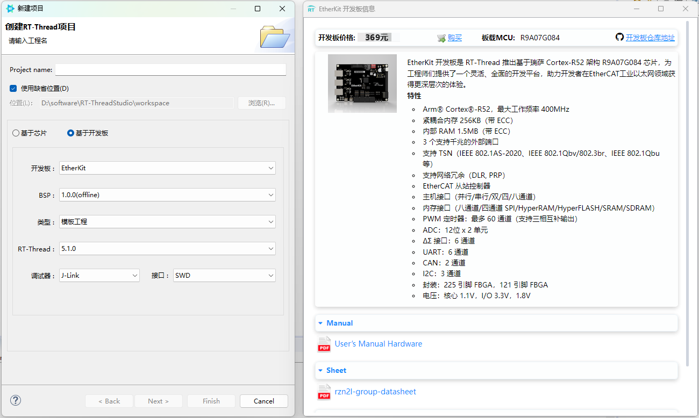
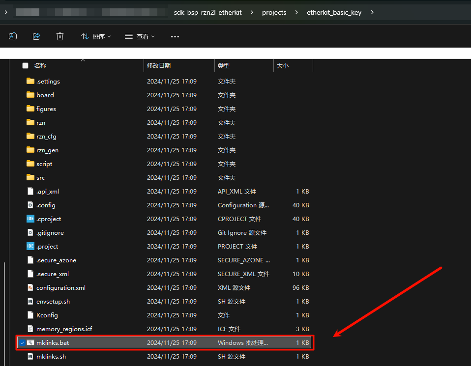
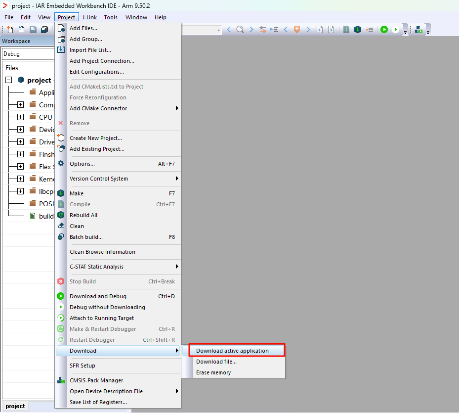

# sdk-bsp-rzn2l-etherkit

**中文** | [**English**](./README.md)

## 简介

中文页

sdk-bsp-rzn2l-etherkit 是 RT-Thread 团队对 `EtherKit`  开发板所作的支持包，也可作为用户开发使用的软件SDK，让用户可以更简单方便的开发自己的应用程序。

EtherKit 开发板是 RT-Thread 推出基于 Arm Cortex®-R52 架构 R9A07G084M04GBG 芯片，为工程师们提供了一个灵活、全面的开发平台，为工程师们提供了一个灵活、全面的开发平台，助力开发者在EtherCAT工业以太网领域获得更深层次的体验。


## 目录结构

```
$ sdk-bsp-rzn2l-etherkit
├── README.md
├── sdk-bsp-rzn2l-etherkit.yaml
├── documents
│   ├── rzn2l-group-datasheet.pdf
│   ├── EtherKit_Board_Schematic.pdf
│   ├── User’s Manual Hardware.pdf
│   └── EtherKit用户手册_V0.1.0.pdf
├── libraries
│   ├── HAL_Drivers
├── projects
│   ├── etherkit_basic_key_irq
│   ├── etherkit_basic_rtc
│   ├── etherkit_blink_led
│   ├── etherkit_basic_key
│   ├── etherkit_driver_canfd
│   ├── etherkit_driver_gpt
│   ├── etherkit_driver_i2c
│   ├── etherkit_driver_rs485
│   ├── etherkit_driver_spi
│   ├── etherkit_driver_wdt
│   ├── etherkit_ethercat_eoe
│   ├── etherkit_ethernet
│   ├── etherkit_factory
│   ├── etherkit_modbus_tcpip
│   ├── etherkit_modbus_uart
│   ├── etherkit_usb_pcdc
│   ├── etherkit_usb_pmsc
│   ├── etherkit_component_mqtt
│   └── etherkit_profinet_pnet
└── rt-thread
```

- sdk-bsp-rzn2l-etherkit.yaml：描述 EtherKit 的硬件信息
- documents：开发板原理图，文档，图片以及 datasheets 等
- libraries ：EtherKit 通用外设驱动
- projects：示例工程文件夹，包含出厂程序，EtherCAT 程序等
- rt-thread： rt-thread 源码

## 使用方式

`sdk-bsp-rzn2l-etherkit` 支持 **RT-Thread Studio** 和 **IAR** 开发方式

## **RT-Thread Studio 开发步骤**

1. 打开RT-Thread Studio ，安装 EtherKit 开发板支持包（如有最新建议安装最新版本，下图版本仅供参考）


2. 新建 EtherKit 工程，选择左上角文件->新建->RT-Thread 项目->基于开发板，可以创建示例工程和模板工程



3. 进行工程的编译和下载：


## IAR开发步骤

1. 双击 mklinks.bat 文件，执行脚本后会生成 rt-thread、libraries 两个文件夹：



**注意：如果无法执行mklinks脚本，需要手动将 `sdk-bsp-rzn2l-etherkit` 目录下的 rt-thread、libraries 两个文件夹手动拷贝到工程目录**

2. 双击 **project.eww** 文件打开IAR工程


3. 点击下图按钮进行项目全编译：


4. 点击下图按钮进行固件烧录：


