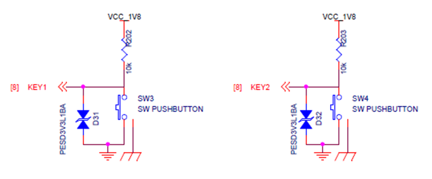
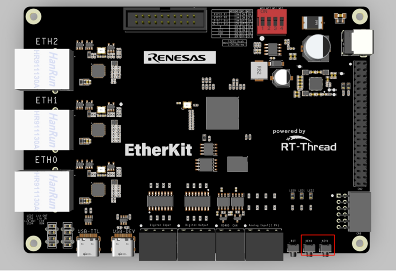
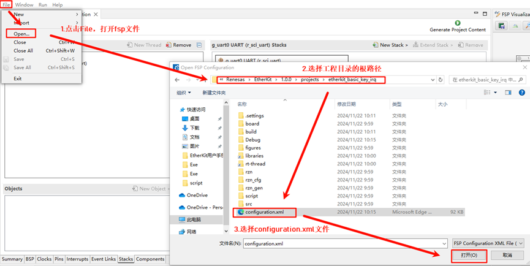
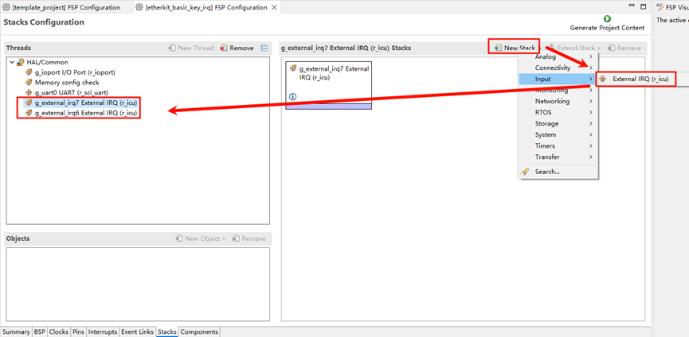
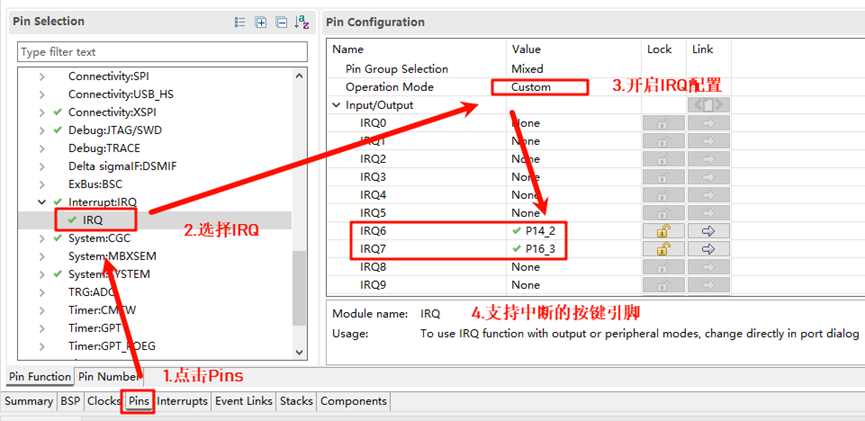
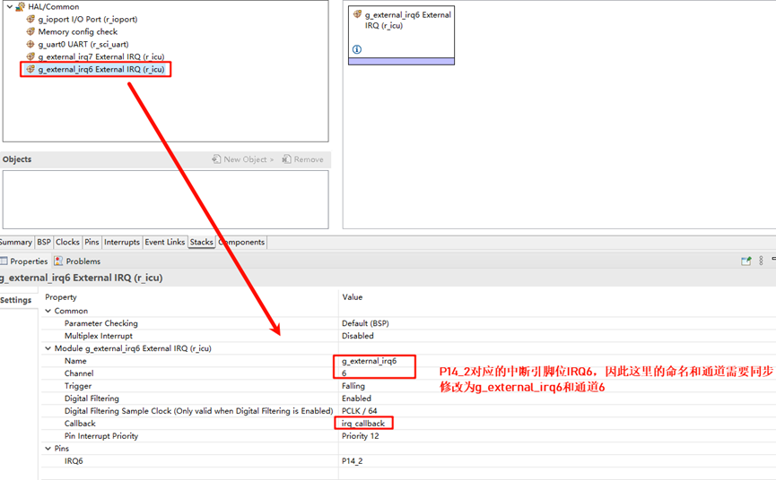
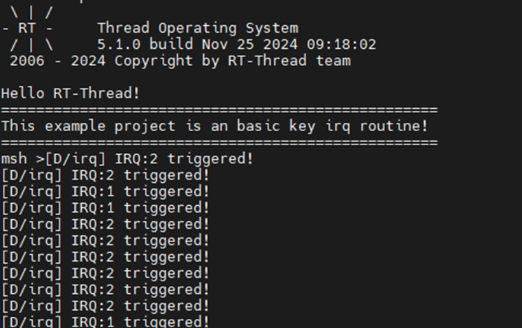

# Button Interrupt Usage Instructions

**English** | [**中文**](./README_zh.md)

## Introduction

This example demonstrates how to use the onboard button (KEY) to trigger an external interrupt. When a specified KEY is pressed, related information is printed, and the corresponding LED is activated.

## Hardware Description




As shown in the diagram above, KEY1 (LEFT) and KEY2 (RIGHT) are connected to MCU pins P14_2 (LEFT) and P16_3 (RIGHT), respectively. Pressing the KEY button generates a high signal, and releasing it generates a low signal.

The positions of the keys on the development board are shown in the following diagram:



## FSP Configuration

First, download the official FSP code generation tool:

* https://github.com/renesas/rzn-fsp/releases/download/v2.0.0/setup_rznfsp_v2_0_0_rzsc_v2024-01.1.exe

Once installed, double-click `rasc.exe` in Eclipse and open the project configuration file `configuration.xml` as shown in the following image:



Next, add two stacks: New Stack -> Input -> External IRQ (r_icu):



Now, enable the IRQ functionality in the pin configuration. Select the two interrupt pins to be enabled: KEY1 (IRQ6) and KEY2 (IRQ7):



Return to the Stacks interface and configure IRQ6 and IRQ7 by specifying the interrupt names, channel numbers, and callback functions:



## Example Code Description

The source code for this example is located at `/projects/etherkit_basic_key_irq`.

The MCU pin definitions for KEY1 (LEFT) and KEY2 (RIGHT) are as follows:

```c
/* Configure key IRQ pins */

#define IRQ_TEST_PIN1 BSP_IO_PORT_14_PIN_2
#define IRQ_TEST_PIN2 BSP_IO_PORT_16_PIN_3
```

The MCU pin definitions for the LED are as follows:

```c
/* Configure LED pins */
#define LED_PIN_B    BSP_IO_PORT_14_PIN_0 /* Onboard BLUE LED pins */
#define LED_PIN_G    BSP_IO_PORT_14_PIN_1 /* Onboard GREEN LED pins */
```

The source code for the button interrupt is located at `/projects/etherkit_basic_key_irq/src/hal_entry.c`. When the corresponding interrupt button is pressed, it triggers the printing of related information.

```c
static void irq_callback_test(void *args)
{
    rt_kprintf("\n IRQ:%d triggered \n", args);
}

void hal_entry(void)
{
    rt_kprintf("\nHello RT-Thread!\n");
    rt_kprintf("==================================================\n");
    rt_kprintf("This example project is a basic key IRQ routine!\n");
    rt_kprintf("==================================================\n");

    /* init */
    rt_err_t err = rt_pin_attach_irq(IRQ_TEST_PIN1, PIN_IRQ_MODE_RISING, irq_callback_test, (void *)1);
    if (RT_EOK != err)
    {
        rt_kprintf("\n attach irq failed. \n");
    }
    err = rt_pin_attach_irq(IRQ_TEST_PIN2, PIN_IRQ_MODE_RISING, irq_callback_test, (void *)2);
    if (RT_EOK != err)
    {
        rt_kprintf("\n attach irq failed. \n");
    }

    err = rt_pin_irq_enable(IRQ_TEST_PIN1, PIN_IRQ_ENABLE);
    if (RT_EOK != err)
    {
        rt_kprintf("\n enable irq failed. \n");
    }
    err = rt_pin_irq_enable(IRQ_TEST_PIN2, PIN_IRQ_ENABLE);
    if (RT_EOK != err)
    {
        rt_kprintf("\n enable irq failed. \n");
    }
}
```

## Compilation & Download

* **RT-Thread Studio**: In RT-Thread Studio's package manager, download the EtherKit resource package, create a new project, and compile it.

* **IAR**: First, double-click `mklinks.bat` to create symbolic links between RT-Thread and the libraries folder. Then, use the `Env` tool to generate the IAR project. Finally, double-click `project.eww` to open the IAR project and compile it.

After compiling, connect the development board's JLink interface to the PC and download the firmware to the development board.

## Run Effect

After pressing the reset button to restart the development board, the initial state has both LED1 and LED2 turned off. When KEY1 is pressed, LED1 (Blue) will light up; when KEY2 is pressed, LED2 (Green) will light up.

