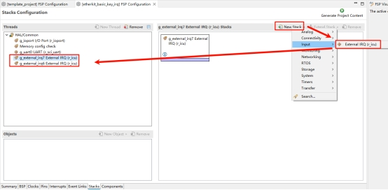
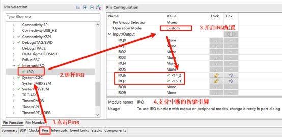

# RZ EtherKit 开发板 KEY使用 说明

**中文** | [**English**](./README.md)

## 简介

​	本例程主要功能是通过板载的按键KEY控制RGB-LED 中RGB的亮灭。

## 硬件说明

 

图3-1 key电路原理图

 

图3-2 key引脚示意图

如上图所示， KEY1(LEFT)、KEY2(RIGHT)引脚分别连接单片机P14_2(LEFT)和P16_3(RIGHT)引脚, KEY按键按下为高电平，松开为低电平。

KEY 在开发板中的位置如下图所示：

 

图3-3 按键位置

## 软件说明

## FSP配置

​	首先下载官方FSP代码生成工具：https://github.com/renesas/rzn-fsp/releases/download/v2.0.0/setup_rznfsp_v2_0_0_rzsc_v2024-01.1.exe；安装成功之后我们双击eclipse下的rasc.exe，并依次根据下图打开工程配置文件configuration.xml：

 

打开配置文件

​	下面我们新增两个Stack：New Stack->Input->External IRQ(r_icu)；

 

 新增IRQ Stack

​	接着我们需要在引脚配置那开启IRQ功能，根据下图选中我们要使能的两个中断引脚：KEY1(IRQ6)和KEY2(IRQ7)；

 

 IRQ开启

​	回到Stacks界面，这里分别设置IRQ6和IRQ7，配置对应的中断名称、通道号以及中断回调函数；

 

 IRQ配置

###  示例代码说明

本例程的源码位于/projects/etherkit_basic_key_irq。

KEY1(LEFT) 、KEY2(RIGHT)对应的单片机引脚定义如下。

```
/* 配置 key irq 引脚 */

 

#define IRQ_TEST_PIN1 BSP_IO_PORT_14_PIN_2

#define IRQ_TEST_PIN2 BSP_IO_PORT_16_PIN_3

LED灯的单片机引脚定义如下。

/* 配置 LED 灯引脚 */
#define LED_PIN_B   BSP_IO_PORT_14_PIN_0 /* Onboard BLUE LED pins */

#define LED_PIN_G   BSP_IO_PORT_14_PIN_1 /* Onboard GREEN LED pins */
```

 

按键中断的源代码位于/projects/etherkit_basic_key_irq/src/hal_entry.c中，当按下对应的中断按键，会触发相应的打印信息。

```
static void irq_callback_test(void *args)

{

  rt_kprintf("\n IRQ:%d triggered \n", args);

}

 

void hal_entry(void)

{

  rt_kprintf("\nHello RT-Thread!\n");

  rt_kprintf("==================================================\n");

  rt_kprintf("This example project is an basic key irq routine!\n");

  rt_kprintf("==================================================\n");

 

  /* init */

  rt_err_t err = rt_pin_attach_irq(IRQ_TEST_PIN1, PIN_IRQ_MODE_RISING, irq_callback_test, (void *)1);

  if (RT_EOK != err)

  {

​    rt_kprintf("\n attach irq failed. \n");

  }

  err = rt_pin_attach_irq(IRQ_TEST_PIN2, PIN_IRQ_MODE_RISING, irq_callback_test, (void *)2);

  if (RT_EOK != err)

  {

​    rt_kprintf("\n attach irq failed. \n");

  }

 

  err = rt_pin_irq_enable(IRQ_TEST_PIN1, PIN_IRQ_ENABLE);

  if (RT_EOK != err)

  {

​    rt_kprintf("\n enable irq failed. \n");

  }

  err = rt_pin_irq_enable(IRQ_TEST_PIN2, PIN_IRQ_ENABLE);

  if (RT_EOK != err)

  {

​    rt_kprintf("\n enable irq failed. \n");

  }

}
```

## 运行

### 编译&下载

l RT-Thread Studio：在RT-Thread Studio 的包管理器中下载EtherKit 资源包，然后创建新工程，执行编译。

l IAR：首先双击mklinks.bat，生成rt-thread 与libraries 文件夹链接；再使用Env 生成IAR 工程；最后双击project.eww打开IAR工程，执行编译。

编译完成后，将开发板的Jlink接口与PC 机连接，然后将固件下载至开发板。

### 运行效果

按下复位按键重启开发板，初始状态下的LED1和LED2出于灭灯状态，当按下KEY1时，LED1(Blue)亮起；当按下KEY2时，LED2(Green)亮起。

 

## 注意事项

​	暂无

## 引用参考

设备与驱动：[PIN 设备](https://www.rt-thread.org/document/site/#/rt-thread-version/rt-thread-standard/programming-manual/device/pin/pin)

