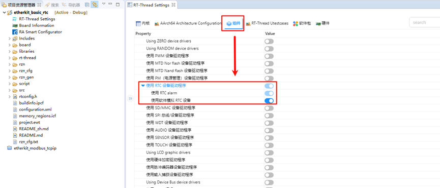

# RTC及Alarm 使用说明

**中文** | [**English**](./README.md)

## 简介

本例程主要介绍了如何在EtherKit上使用RTC（Real-Time Clock）实时时钟，RTC 可以提供精确的实时时间，它可以用于产生年、月、日、时、分、秒等信息。目前实时时钟芯片大多采用精度较高的晶体振荡器作为时钟源。有些时钟芯片为了在主电源掉电时还可以工作，会外加电池供电，使时间信息一直保持有效。

RT-Thread 的RTC 设备为操作系统的时间系统提供了基础服务。面对越来越多的IoT 场景，RTC 已经成为产品的标配，甚至在诸如SSL 的安全传输过程中，RTC 已经成为不可或缺的部分。

## 硬件说明

本例程使用的RTC 设备依赖于LSE 时钟，此外无需过多连接。

## FSP配置说明

打开FSP，选择对应的工程文件下的configuration.xml，新增RTC Stack;


下面进行RTC参数的配置，设置rtc stack name为g_rtc，设置RTC中断回调函数为rtc_callback，并配置中断回调优先级；


## RT-Thread Settings配置

打开RT-Thread Settings，找到硬件选项，使能RTC；


接下来我们配置RTC，首先需要使能RT-Thread的RTC设备框架，同时使能软件alarm功能（注：瑞萨rzn系列的alarm功能暂时存在一些问题，因此闹钟功能暂时使用软件模拟，不影响使用）；



##  示例代码说明

本例程的源码位于/projects/etherkit_basic_rtc。在hal_entry()函数中，获取到了RTC 设备，然后设置一次系统时间，随后获取一次系统时间以便检测时间是否设置成功，最后延时1s 后再次获取系统时间。

```c
    rt_err_t ret = RT_EOK;
    time_t now;
    rt_device_t device = RT_NULL;

    device = rt_device_find(RTC_NAME);
    if (!device)
    {
      rt_kprintf("find %s failed!\n", RTC_NAME);
    }

    if(rt_device_open(device, 0) != RT_EOK)
    {
      rt_kprintf("open %s failed!\n", RTC_NAME);
    }

    /* 设置日期 */
    ret = set_date(2024, 11, 11);
    rt_kprintf("set RTC date to 2024-11-11\n");
    if (ret != RT_EOK)
    {
        rt_kprintf("set RTC date failed\n");
    }

    /* 设置时间 */
    ret = set_time(15, 00, 00);
    if (ret != RT_EOK)
    {
        rt_kprintf("set RTC time failed\n");
    }

    /* 延时3秒 */
    rt_thread_mdelay(3000);

    /* 获取时间 */
    get_timestamp(&now);
    rt_kprintf("now: %.*s", 25, ctime(&now));
```

下面代码可创建一个RTC 闹钟，然后设置1秒后唤醒，最后把该函数导入msh 命令行中。

```c
void user_alarm_callback(rt_alarm_t alarm, time_t timestamp)
{
    rt_kprintf("user alarm callback function.\n");
}

void alarm_sample(void)
{
    rt_device_t dev = rt_device_find("rtc");
    struct rt_alarm_setup setup;
    struct rt_alarm * alarm = RT_NULL;
    static time_t now;
    struct tm p_tm;

    if (alarm != RT_NULL)
        return;

    /* 获取当前时间戳，并把下一秒时间设置为闹钟时间 */
    now = get_timestamp(NULL) + 1;
    gmtime_r(&now,&p_tm);

    setup.flag = RT_ALARM_SECOND;
    setup.wktime.tm_year = p_tm.tm_year;
    setup.wktime.tm_mon = p_tm.tm_mon;
    setup.wktime.tm_mday = p_tm.tm_mday;
    setup.wktime.tm_wday = p_tm.tm_wday;
    setup.wktime.tm_hour = p_tm.tm_hour;
    setup.wktime.tm_min = p_tm.tm_min;
    setup.wktime.tm_sec = p_tm.tm_sec;

    alarm = rt_alarm_create(user_alarm_callback, &setup);
    if(RT_NULL != alarm)
    {
        rt_alarm_start(alarm);
    }
}
/* export msh cmd */
MSH_CMD_EXPORT(alarm_sample,alarm sample);

```

## 编译&下载

* RT-Thread Studio：在RT-Thread Studio 的包管理器中下载EtherKit 资源包，然后创建新工程，执行编译。
* IAR：首先双击 mklinks.bat，生成 rt-thread 与 libraries 文件夹链接；再使用Env 生成IAR工程；最后双击 project.eww 打开 IAR 工程，执行编译。

编译完成后，将开发板的Jlink接口与PC 机连接，然后将固件下载至开发板。

## 运行效果

按下复位按键重启开发板，可以看到板子上会打印如下信息：

```c
 \ | /
- RT -     Thread Operating System
 / | \     5.1.0 build Nov 13 2024 13:35:43
 2006 - 2024 Copyright by RT-Thread team

Hello RT-Thread!
==================================================
This example project is an rtc and alarm routine!
==================================================
set RTC date to 2024-11-11
msh >now: Sat Nov 19 07:42:42 3385
msh >alarm_sample
user alarm callback function.
user alarm callback function.
user alarm callback function.
user alarm callback function.
```
