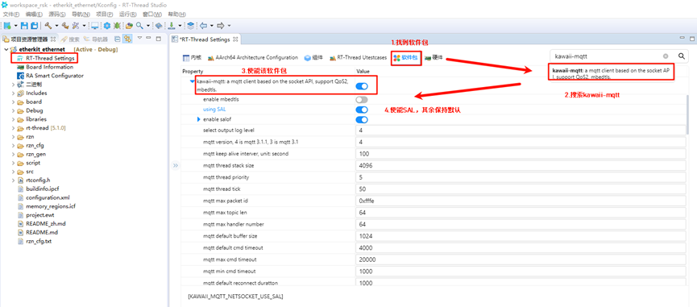
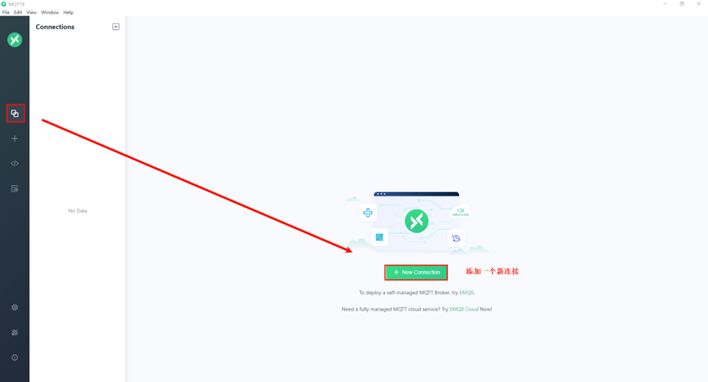

# MQTT Usage Instructions

**English** | [**中文**](./README_zh.md)

## Introduction

This example is based on the kawaii-mqtt package and demonstrates the functionality of subscribing to topics and publishing messages to specific topics using the MQTTX software.

## Hardware Requirements

This example requires the Ethernet module on the EtherKit board for network communication, so please ensure that the Ethernet module on the hardware platform is functioning properly.

## FSP Configuration Instructions

Open the project configuration file `configuration.xml` and add the `r_gamc` stack:


Click on `g_ether0` Ethernet and configure the interrupt callback function as `user_ether0_callback`:


Next, configure the PHY information. Select `g_ether_phy0`, set the Common configuration to "User Own Target", change the PHY LSI address to 1 (refer to the schematic for the specific address), and set the PHY initialization callback function to `ether_phy_targets_initialize_rtl8211_rgmii()`. Also, set MDIO to GMAC.


Configure `g_ether_selector0`, set the Ethernet mode to switch mode, configure PHY link as default active-low, and set the PHY interface mode to RGMII.


Configure the network card pin parameters, selecting the operation mode as RGMII:


Configure `ETHER_GMAC`:


## RT-Thread Studio Configuration

Return to the Studio project, configure RT-Thread Settings, select hardware options, and enable Ethernet:


In the software package interface, search for the kawaii-mqtt package and enable the SAL option:



## Example Code Explanation

This code implements an MQTT communication demonstration program based on the Kawaii MQTT client library. It connects to an MQTT broker, subscribes to topics, and periodically publishes messages.

```c
static void sub_topic_handle1(void* client, message_data_t* msg)
{
    (void) client;
    KAWAII_MQTT_LOG_I("-----------------------------------------------------------------------------------");
    KAWAII_MQTT_LOG_I("%s:%d %s()...\ntopic: %s\nmessage:%s", __FILE__, __LINE__, __FUNCTION__, msg->topic_name, (char*)msg->message->payload);
    KAWAII_MQTT_LOG_I("-----------------------------------------------------------------------------------");
}
static int mqtt_publish_handle1(mqtt_client_t *client)
{
    mqtt_message_t msg;
    memset(&msg, 0, sizeof(msg));
    msg.qos = QOS0;
    msg.payload = (void *)"this is a kawaii mqtt test ...";
    return mqtt_publish(client, "pub5323", &msg);
}
static char cid[64] = { 0 };
static void kawaii_mqtt_demo(void *parameter)
{
    mqtt_client_t *client = NULL;
    rt_thread_delay(6000);
    mqtt_log_init();
    client = mqtt_lease();
    rt_snprintf(cid, sizeof(cid), "rtthread-5323", rt_tick_get());
    mqtt_set_host(client, "broker.emqx.io");
    mqtt_set_port(client, "1883");
    mqtt_set_user_name(client, "RT-Thread");
    mqtt_set_password(client, "012345678");
    mqtt_set_client_id(client, cid);
    mqtt_set_clean_session(client, 1);
    KAWAII_MQTT_LOG_I("The ID of the Kawaii client is: %s ",cid);
    mqtt_connect(client);
    mqtt_subscribe(client, "sub5323", QOS0, sub_topic_handle1);
    while (1) {
        mqtt_publish_handle1(client);
        mqtt_sleep_ms(4 * 1000);
    }
}
int ka_mqtt(void)
{
    rt_thread_t tid_mqtt;
    tid_mqtt = rt_thread_create("kawaii_demo", kawaii_mqtt_demo, RT_NULL, 2048, 17, 10);
    if (tid_mqtt == RT_NULL) {
        return -RT_ERROR;
    }
    rt_thread_startup(tid_mqtt);
    return RT_EOK;
}
MSH_CMD_EXPORT(ka_mqtt, Kawaii MQTT client test program);
```

## Compilation & Download

* **RT-Thread Studio**: Download the EtherKit resource package in RT-Thread Studio's package manager, create a new project, and then compile it.
* **IAR**: First, double-click `mklinks.bat` to create the link between rt-thread and libraries folders. Then, use Env to generate the IAR project. Finally, double-click `project.eww` to open the IAR project and compile it.

Once compilation is complete, connect the development board's Jlink interface to the PC, and download the firmware to the board.

## MQTTX Configuration

Install and run MQTTX. On the main interface, click **New Connection** to create a new connection:



Configure the MQTT client information. Note that the Client ID should not be the same as the one on the development board. You can generate a random ID by clicking the reset button. After configuring the settings, click **Connect** in the top right corner:


Click **+ New Subscription**, change the Topic name to `sub5323`, and confirm:


In the function box below, set the subscription topic name to `sub5323` and configure the subscription settings as needed:


## Running Results

Open a serial tool and run the `ka_mqtt` command to check the output:


## Additional Notes

> MQTTX download link: [https://packages.emqx.net/MQTTX/v1.9.6/MQTTX-Setup-1.9.6-x64.exe](https://packages.emqx.net/MQTTX/v1.9.6/MQTTX-Setup-1.9.6-x64.exe)