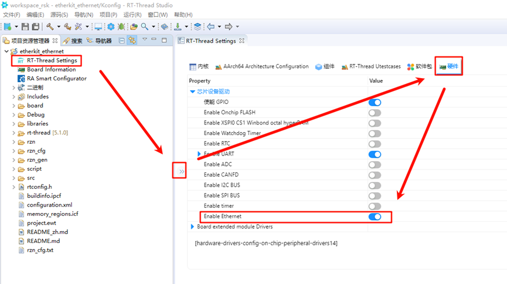

# EtherKit Development Board BSP Instructions

**English** | [**中文**](./README_zh.md)

## Introduction

This project provides basic Ethernet functionalities, including `ping`, `tftp`, `ntp`, and `iperf`.

## Hardware Connection

To use Ethernet, connect the development board to any one of the three network ports using an Ethernet cable, and the other end should be connected to a network switch that has internet access.

## FSP Configuration Instructions

Open the project configuration file `configuration.xml` and add the `r_gamc` stack:

Next, click on `g_ether0 Ethernet`, and configure the interrupt callback function to `user_ether0_callback`:

Now configure the PHY settings. Select `g_ether_phy0`, set the common configuration to "User Own Target", change the PHY LSI address to `1` (refer to the schematic for the exact address), and set the PHY initialization callback function to `ether_phy_targets_initialize_rtl8211_rgmii()`. Also, set the MDIO to GMAC.

Next, configure `g_ether_selector0`, set the Ethernet mode to "Switch Mode", set the PHY link to "Default Active-Low", and choose "RGMII" for the PHY interface mode.

Configure the Ethernet pin parameters and select the operating mode to RGMII:

Finally, configure `ETHER_GMAC`:

## RT-Thread Studio Configuration

Return to the Studio project, and configure RT-Thread Settings. Click on "Hardware", find the chip device driver, and enable Ethernet:

In the RT-Thread Settings, search for the `netutils` software package and enable the `tftp`, `iperf`, and `ntp` features:

## Ethernet IP Experiment Results

After flashing the code to the development board, open the serial terminal to view the logs:

## **TFTP Server Send Test**

1. Install the Tftpd64-4.60-setup software from `netutils-v1.3.3\tools`:

   

2. Go back to the development board serial terminal and input the `tftp_server` command to start the TFTP server service:

3. Open the installed Tftpd64-4.60 software:

   - Set **Host** to the development board's IP address;
   - Set **Port** to the TFTP server's port (default is 69);
   - Set **Local File** to the file path where the client will send the file (including filename);
   - Click **Put** to send the file to the device.

4. After clicking "Put", a message will indicate that the file has been sent:

5. Back at the development board terminal, input `ls` to see that the `1.txt` file has been received. You can input `cat 1.txt` to check if the file content matches what was sent:

   - Note: Since **ramfs** is enabled, do not send files larger than 128KB. This is for testing purposes only.

## **TFTP Receive Test**

1. Back at the development board serial terminal, input `echo "rtthread" 2.txt` to create a file with custom content:

2. You can verify the file creation and content:

3. Open the installed Tftpd64-4.60 software:

   - Set **Local File** to the path where the client will save the received file (including filename);
   - Set **Remote File** to the path of the file on the server (including filename), i.e., the file to be received;
   - Set the TFTP server port to 69;
   - Click **Get** to receive the file.

   - You should see that `2.txt` has been successfully received, and its content matches the file in the development board's file system:

## NTP Network Time Synchronization

> NTP (Network Time Protocol) is a protocol used to synchronize computer clocks with a global time standard.

### NTP Experiment Results

After flashing the code to the development board, open the serial terminal to view the logs:

Input the `ntp_sync` command, and you should see the network time synchronization result. Input the `date` command to check that the RTC time has been synchronized:

