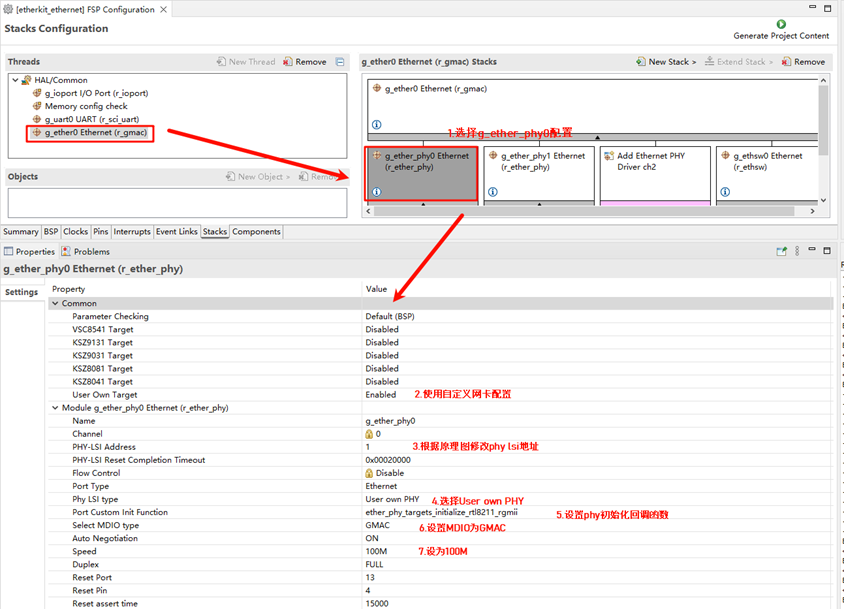
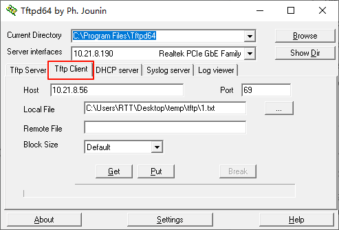

# EtherKit 开发板 BSP 说明

**中文** | [**English**](./README.md)

## 简介

本工程提供 ethernet 的基础功能，包括 `ping `、`tftp`、`ntp` 、`iperf` 等功能。

## 硬件连接

需要使用网线连接到开发板的三网口其中任意一个网口，另一头连接到可以联网的交换机上。

## FSP配置说明

打开工程配置文件configuration.xml，新增r_gamc Stack：

点击g_ether0 Ethernet，配置中断回调函数为user_ether0_callback：

下面配置phy信息，选择g_ether_phy0，Common配置为User Own Target；修改PHY LSI地址为1（根据原理图查询具体地址）；设置phy初始化回调函数为ether_phy_targets_initialize_rtl8211_rgmii()；同时设置MDIO为GMAC。

配置g_ether_selector0，选择以太网模式为交换机模式，PHY link设置为默认active-low，PHY接口模式设置为RGMII。

网卡引脚参数配置，选择操作模式为RGMII：

ETHER_GMAC配置：

## RT-Thread Studio配置

回到Studio工程，配置RT-Thread Settings，点击选择硬件选项，找到芯片设备驱动，使能以太网；

打开 RT-Thread Settings，软件包搜索netutils，并使能tftp、iperf、ntp功能；

## 以太网IP实验现象

烧录代码到开发板，打开串口终端查看日志：

## **TFTP Server 发送测试**

1. 安装 netutils-v1.3.3\tools 下的Tftpd64-4.60-setup软件

   

2. 先回到开发板串口终端，输入tftp_server命令开启tftp-server服务

3. 然后打开安装好的Tftpd64-4.60软件

   ● Host是开发板的IP地址；

​       ● Port是 TFTP 服务器端口号，默认： 69；                      

​       ● Local File 是客户端发送文件的存放路径（包含文件名）；

​       ● 最后点击 Put 按钮即可发送文件到设备端。

4. 点击Put后，会提示已经发送信息:

5. 返回开发板终端，输入ls，可以看到已经接收到电脑发来的1.txt文件；可以输入cat 1.txt查看内容是否和我们发送文件的一致；

​        ● 注意：由于使能的是**ramfs**，因此不要传输超过128KB的文件！仅作为测试使用

## **TFTP接收测试**

1. 先回到开发板串口终端，输入**echo "rtthread" 2.txt**创建并向文件中写入自定义内容:

2. 可以验证下是否创建并写入成功:

3. 打开安装好的Tftpd64-4.60软件:

​                ● Local File 是 客户端接收文件的存放路径（包含文件名）；

​                ● Remote File 是服务器发送文件的路径（包括文件名），请输入我们想要接收的文件名称；

​                ● 填写 TFTP 服务器端口号，默认： 69；

​                ● 点击 Get 按钮；

​				● 可以看到2.txt已经接受成功，内容也是开发板文件系统中的文件内容

## NTP联网校时

> NTP（Network Time Protocol）是一种用于同步计算机时间的协议。它能够确保计算机时钟与全球统一的时间标准保持同步。

### NTP实验现象

烧录代码到开发板，打开串口终端查看日志：

输入ntp_sync指令后，可以看到已经获取到网络时间，输入date指令后可以看到已经同步RTC的时间了

