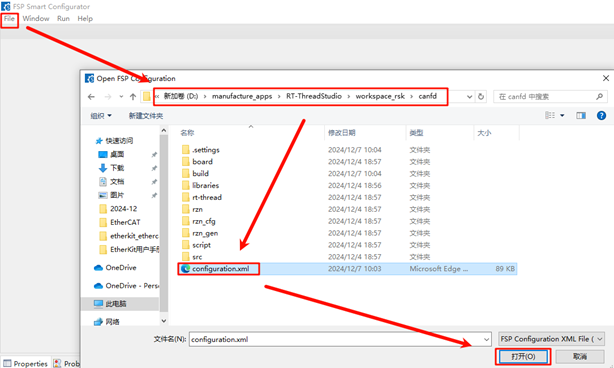
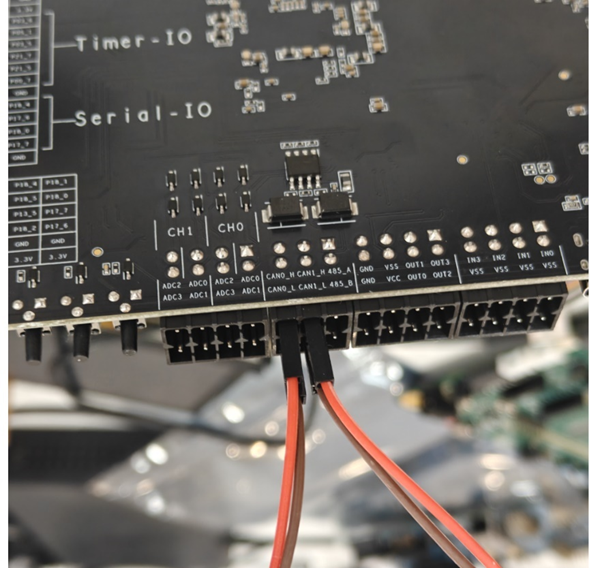

# CANFD Driver Usage Instructions

**English** | **[Chinese](./README_zh.md)**

## Introduction

This tutorial mainly introduces how to use the CANFD device on the EtherKit.

## Hardware Description


## Software Description

### FSP Configuration Guide

Select the configuration.xml file under the newly created project and open it in rzn-fsp.



Click to add a new stack, search for `canfd`, and add `r_canfd`. Here, we need to add two `canfd_stack`.


In the basic configuration, enable the reception FIFO interrupt for `canfd0` and `canfd1` by selecting Common -> Reception -> FIFOs -> FIFO 0 / FIFO 1 -> Enable. For `canfd0`, enable FIFO 0 interrupt, and for `canfd1`, enable FIFO 1 interrupt:


Next, we need to configure the channel, interrupt callback functions, and filter array for CANFD.


Configure and enable the CANFD pins.


Next, enable the interrupt configuration for the message buffer, which determines which message buffer will trigger the interrupt when transmission is complete.


### RT-Thread Settings Configuration

Open RT-Thread Settings and enable the CANFD configuration.


### Project Example Description

The project sends a message using `canfd0` and receives it using `canfd1`, printing the result via serial port.

Example send code:

```c
int can0_sample_send(int argc, char *argv[])
{
    rt_err_t res;
    rt_thread_t thread;
    char can_name[RT_NAME_MAX];
    if (argc == 2)
    {
        rt_strncpy(can_name, argv[1], RT_NAME_MAX);
    }
    else
    {
        rt_strncpy(can_name, CAN0_DEV_NAME, RT_NAME_MAX);
    }
    /* Find the CAN device */
    can0_dev = rt_device_find(can_name);
    if (!can0_dev)
    {
        rt_kprintf("find %s failed!\n", can_name);
        return RT_ERROR;
    }
    /* Open the CAN device for interrupt-based receive and send */
    res = rt_device_open(can0_dev, RT_DEVICE_FLAG_INT_TX | RT_DEVICE_FLAG_INT_RX);
    RT_ASSERT(res == RT_EOK);
    /* Create data reception thread */
    thread = rt_thread_create("can0_tx", can0_tx_thread, RT_NULL, 1024, 25, 10);
    if (thread != RT_NULL)
    {
        rt_thread_startup(thread);
    }
    else
    {
        rt_kprintf("create can_rx thread failed!\n");
    }
    return res;
}
/* Export to msh command list */
MSH_CMD_EXPORT(can0_sample_send, can device sample);
int can1_sample_receive(int argc, char *argv[])
{
    rt_err_t res;
    rt_thread_t thread;
    char can_name[RT_NAME_MAX];
    if (argc == 2)
    {
        rt_strncpy(can_name, argv[1], RT_NAME_MAX);
    }
    else
    {
        rt_strncpy(can_name, CAN1_DEV_NAME, RT_NAME_MAX);
    }
    /* Find the CAN device */
    can1_dev = rt_device_find(can_name);
    if (!can1_dev)
    {
        rt_kprintf("find %s failed!\n", can_name);
        return RT_ERROR;
    }
    /* Initialize CAN reception semaphore */
    rt_sem_init(&rx_sem, "rx_sem", 0, RT_IPC_FLAG_FIFO);

    /* Open the CAN device for interrupt-based receive and send */
    res = rt_device_open(can1_dev, RT_DEVICE_FLAG_INT_TX | RT_DEVICE_FLAG_INT_RX);
    RT_ASSERT(res == RT_EOK);
    /* Create data reception thread */
    thread = rt_thread_create("can1_rx", can1_rx_thread, RT_NULL, 1024, 25, 10);
    if (thread != RT_NULL)
    {
        rt_thread_startup(thread);
    }
    else
    {
        rt_kprintf("create can_rx thread failed!\n");
    }
    return res;
}
```

## Operation

### Compilation & Download

* **RT-Thread Studio**: Download the EtherKit resource package from the RT-Thread Studio package manager, then create a new project and compile.
* **IAR**: First, double-click `mklinks.bat` to generate links to the `rt-thread` and `libraries` folders. Then use Env to generate the IAR project. Finally, double-click `project.eww` to open the IAR project and compile.

After compiling, connect the Jlink interface of the development board to the PC and download the firmware to the development board.

### Running Effect

Connect `CAN0_L` to `CAN1_L`, and `CAN0_H` to `CAN1_H`, as shown in the image below:



Use the serial port to send the `can0_sample_send` and `can1_sample_receive` commands for loopback testing:

