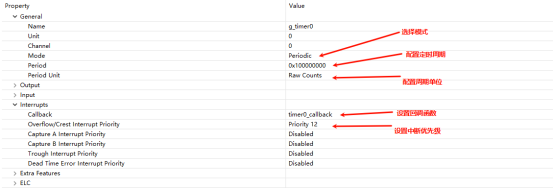
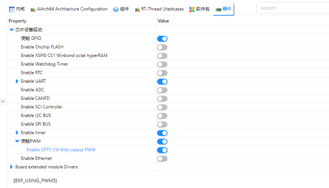

# GPT Driver Usage Instructions

**English** | [**中文**](./README_zh.md)

## Introduction

In our specific application scenarios, the use of timers is often indispensable. This example mainly introduces how to use the GPT device on the EtherKit board, including the basic timer usage and PWM usage.

## FSP Configuration Instructions

The FSP is configured to enable GPT0 as a basic timer mode and GPT5 as a PWM mode:




Additionally, the pins for GPT0 and GPT5 are enabled:


### RT-Thread Settings Configuration

In the configuration, enable timer0 and PWM:




### Example Project Instructions

The source code for this example is located in `/projects/etherkit_driver_gpt`:

```c
int hwtimer_sample(void)
{
    rt_err_t ret = RT_EOK;
    rt_hwtimerval_t timeout_s;
    rt_device_t hw_dev = RT_NULL;
    rt_hwtimer_mode_t mode;
    rt_uint32_t freq = 400000000; /* 1 MHz */
    hw_dev = rt_device_find(HWTIMER_DEV_NAME);
    if (hw_dev == RT_NULL)
    {
        rt_kprintf("hwtimer sample run failed! can't find %s device!\n", HWTIMER_DEV_NAME);
        return -RT_ERROR;
    }
    ret = rt_device_open(hw_dev, RT_DEVICE_OFLAG_RDWR);
    if (ret != RT_EOK)
    {
        rt_kprintf("open %s device failed!\n", HWTIMER_DEV_NAME);
        return ret;
    }
    rt_device_set_rx_indicate(hw_dev, timeout_cb);
    rt_device_control(hw_dev, HWTIMER_CTRL_FREQ_SET, &freq);
    mode = HWTIMER_MODE_PERIOD;
    ret = rt_device_control(hw_dev, HWTIMER_CTRL_MODE_SET, &mode);
    if (ret != RT_EOK)
    {
        rt_kprintf("set mode failed! ret is :%d\n", ret);
        return ret;
    }
    /* Example: Set the timeout period of the timer */
    timeout_s.sec = 1;  /* seconds */
    timeout_s.usec = 0; /* microseconds */
    if (rt_device_write(hw_dev, 0, &timeout_s, sizeof(timeout_s)) != sizeof(timeout_s))
    {
        rt_kprintf("set timeout value failed\n");
        return -RT_ERROR;
    }
    /* Read hwtimer value */
    rt_device_read(hw_dev, 0, &timeout_s, sizeof(timeout_s));
    rt_kprintf("Read: Sec = %d, Usec = %d\n", timeout_s.sec, timeout_s.usec);
    return ret;
}
MSH_CMD_EXPORT(hwtimer_sample, hwtimer sample);
```

The interrupt callback function is triggered every 1 second, printing output. Below is the PWM configuration and enablement:

PWM-related macros:

The current version of the PWM driver treats each channel as a separate PWM device, with each device having only one channel (channel 0). Using the PWM5 device, note that channel 0 is selected here:

```c
#define PWM_DEV_NAME        "pwm5"  /* PWM device name */
#define PWM_DEV_CHANNEL      0      /* PWM channel */
struct rt_device_pwm *pwm_dev;      /* PWM device handle */
```

Configure the PWM period and duty cycle:

```c
static int pwm_sample(int argc, char *argv[])
{
    rt_uint32_t period, pulse, dir;
    period = 500000;    /* Period is 0.5 ms, in nanoseconds */
    dir = 1;            /* Direction of PWM pulse width increase/decrease */
    pulse = 100000;     /* PWM pulse width value, in nanoseconds */
    /* Find device */
    pwm_dev = (struct rt_device_pwm *)rt_device_find(PWM_DEV_NAME);
    if (pwm_dev == RT_NULL)
    {
        rt_kprintf("pwm sample run failed! can't find %s device!\n", PWM_DEV_NAME);
        return RT_ERROR;
    }
    /* Set PWM period and default pulse width */
    rt_pwm_set(pwm_dev, PWM_DEV_CHANNEL, period, pulse);
    /* Enable device */
    rt_pwm_enable(pwm_dev, PWM_DEV_CHANNEL);
}
/* Export to msh command list */
MSH_CMD_EXPORT(pwm_sample, pwm sample);
```

## Compilation & Download

* **RT-Thread Studio**: Download the EtherKit resource package in the RT-Thread Studio package manager, then create a new project and compile it.

* **IAR**: First, double-click `mklinks.bat` to generate the links for rt-thread and libraries folders. Then use Env to generate the IAR project, and finally, double-click `project.eww` to open the IAR project and compile it.

After compilation, connect the development board's Jlink interface to the PC, and download the firmware to the development board.

## Running Results

In the serial terminal, input `pwm_sample` and `hwtimer_sample` to see the specific results.

The callback function is triggered every 1 second, and the output is printed:


Using a logic analyzer, the PWM output waveform is measured as follows:

