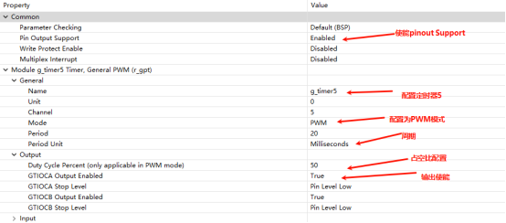

# RZ EtherKit Development Board GPT Usage Guide
**English** | [**中文**](./README_zh.md)

## Introduction

In our specific applications, the use of timers is indispensable. This example mainly introduces how to use the GPT device on the EtherKit, including the use of basic timers and PWM.
## FSP Configuration Instructions
FSP is configured to enable GPT0 as a basic timer mode, and GPT5 as a PWM mode:




And configure pins to enable GPT0 and GPT5:


### RT-Thread Settings Configuration
In the configuration, enable timer0 and PWM:


### Example Project Description
The source code of this example is located at /projects/etherkit_driver_gpt:
```c
int hwtimer_sample(void)
{
rt_err_t ret = RT_EOK;
rt_hwtimerval_t timeout_s;
rt_device_t hw_dev = RT_NULL;
rt_hwtimer_mode_t mode;
rt_uint32_t freq = 400000000; /* 1Mhz */
hw_dev = rt_device_find(HWTIMER_DEV_NAME);
if (hw_dev == RT_NULL)
{
rt_kprintf("hwtimer sample run failed! can't find %s device!\n", HWTIMER_DEV_NAME);
return -RT_ERROR;
}
ret = rt_device_open(hw_dev, RT_DEVICE_OFLAG_RDWR);
if (ret != RT_EOK)
{
rt_kprintf("open %s device failed!\n", HWTIMER_DEV_NAME);
return ret;
}
rt_device_set_rx_indicate(hw_dev, timeout_cb);
rt_device_control(hw_dev, HWTIMER_CTRL_FREQ_SET, &freq);
mode = HWTIMER_MODE_PERIOD;
ret = rt_device_control(hw_dev, HWTIMER_CTRL_MODE_SET, &mode);
if (ret != RT_EOK)
{
rt_kprintf("set mode failed! ret is :%d\n", ret);
return ret;
}
/* Example Set the timeout period of the timer */
timeout_s.sec = 1; /* second */
timeout_s.usec = 0; /* microsecond */
if (rt_device_write(hw_dev, 0, &timeout_s, sizeof(timeout_s)) != sizeof(timeout_s))
{
rt_kprintf("set timeout value failed\n");
return -RT_ERROR;
}
/* read hwtimer value */
rt_device_read(hw_dev, 0, &timeout_s, sizeof(timeout_s));
rt_kprintf("Read: Sec = %d, Usec = %d\n", timeout_s.sec, timeout_s.usec);
return ret;
}
MSH_CMD_EXPORT(hwtimer_sample, hwtimer sample);
```
Trigger an interrupt callback function to print output every 1s, below is the PWM configuration enable:
PWM related macro definitions:
In the current version of the PWM driver, each channel is regarded as a separate PWM device, each device has only one channel 0. Use PWM5 device, note that the channel selection here is channel 0;
Configure PWM period and duty cycle:
```
static int pwm_sample(int argc, char *argv[])
{
rt_uint32_t period, pulse, dir;
period = 500000; /* The period is 0.5ms, in nanoseconds */
dir = 1; /* The direction of increasing or decreasing the PWM pulse width value */
pulse = 100000; /* PWM pulse width value, in nanoseconds */
/* Find device */
pwm_dev = (struct rt_device_pwm *)rt_device_find(PWM_DEV_NAME);
if (pwm_dev == RT_NULL)
{
  rt_kprintf("pwm sample run failed! can't find %s device!\n", PWM_DEV_NAME);
  return RT_ERROR;
}
/* Set the default PWM period and pulse width */
rt_pwm_set(pwm_dev, PWM_DEV_CHANNEL, period, pulse);
/* Enable device */
rt_pwm_enable(pwm_dev, PWM_DEV_CHANNEL);
}
/* Export to msh command list */
MSH_CMD_EXPORT(pwm_sample, pwm sample);
```
## Compile & Download
* RT-Thread Studio: Download the EtherKit resource package in the package manager of RT-Thread Studio, then create a new project and execute the compilation.
* IAR: First double-click mklinks.bat to generate links for the rt-thread and libraries folders; then use Env to generate the IAR project; finally, double-click project.eww to open the IAR project and execute the compilation.
After compilation, connect the development board's Jlink interface to the PC, then download the firmware to the development board.
## Running Results
Enter pwm_sample and hwtimer_sample in the serial terminal to see the specific effects;
Trigger the callback function every 1s and print output:

The Pwm output waveform measured with a logic analyzer is shown below:
