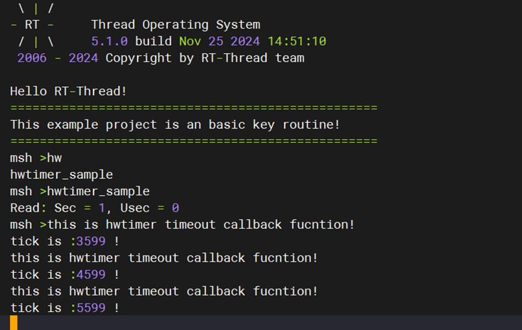

# RZ EtherKit 开发板 GPT使用 说明

**中文** | [**English**](./README.md)

## 简介

在我们具体的应用场合中往往都离不开timer的使用，本例程主要介绍了如何在EtherKit上使用GPT设备，包括基本定时器的使用和PWM的使用。

## FSP配置说明

FSP 分别配置使能GPT0为基本定时器模式，GPT5为PWM 模式：


并配置pins 使能GPT0 GPT5：


### RT-Thread Settings配置

在配置中打开timer0使能：


### 示例工程说明

本例程的源码位于/projects/etherkit_driver_gpt：

```c
int hwtimer_sample(void)
{
    rt_err_t ret = RT_EOK;
    rt_hwtimerval_t timeout_s;
    rt_device_t hw_dev = RT_NULL;
    rt_hwtimer_mode_t mode;
    rt_uint32_t freq = 400000000; /* 1Mhz */
    hw_dev = rt_device_find(HWTIMER_DEV_NAME);
    if (hw_dev == RT_NULL)
    {
        rt_kprintf("hwtimer sample run failed! can't find %s device!\n", HWTIMER_DEV_NAME);
        return -RT_ERROR;
    }
    ret = rt_device_open(hw_dev, RT_DEVICE_OFLAG_RDWR);
    if (ret != RT_EOK)
    {
        rt_kprintf("open %s device failed!\n", HWTIMER_DEV_NAME);
        return ret;
    }
    rt_device_set_rx_indicate(hw_dev, timeout_cb);
    rt_device_control(hw_dev, HWTIMER_CTRL_FREQ_SET, &freq);
    mode = HWTIMER_MODE_PERIOD;
    ret = rt_device_control(hw_dev, HWTIMER_CTRL_MODE_SET, &mode);
    if (ret != RT_EOK)
    {
        rt_kprintf("set mode failed! ret is :%d\n", ret);
        return ret;
    }
    /* Example Set the timeout period of the timer */
    timeout_s.sec = 1;  /* secend */
    timeout_s.usec = 0; /* microsecend */
    if (rt_device_write(hw_dev, 0, &timeout_s, sizeof(timeout_s)) != sizeof(timeout_s))
    {
        rt_kprintf("set timeout value failed\n");
        return -RT_ERROR;
    }
    /* read hwtimer value */
    rt_device_read(hw_dev, 0, &timeout_s, sizeof(timeout_s));
    rt_kprintf("Read: Sec = %d, Usec = %d\n", timeout_s.sec, timeout_s.usec);
    return ret;
}
MSH_CMD_EXPORT(hwtimer_sample, hwtimer sample);
```
每隔1s 中触发一次中断回调函数打印输出，下面是PWM 配置使能：

```c
void GPT_PWM_Init(void)
{
    R_GPT_Open(&g_timer5_ctrl, &g_timer5_cfg);
    R_GPT_Start(&g_timer5_ctrl);
}
```

##  编译&下载

* RT-Thread Studio：在RT-Thread Studio 的包管理器中下载EtherKit 资源包，然后创建新工程，执行编译。

* IAR：首先双击mklinks.bat，生成rt-thread与libraries 文件夹链接；再使用Env 生成IAR工程；最后双击project.eww打开IAR工程，执行编译。

编译完成后，将开发板的Jlink接口与PC 机连接，然后将固件下载至开发板。

## 运行效果

每隔1s触发回调函数并打印输出：



使用逻辑分析仪量取Pwm 输出波形如下所示：


