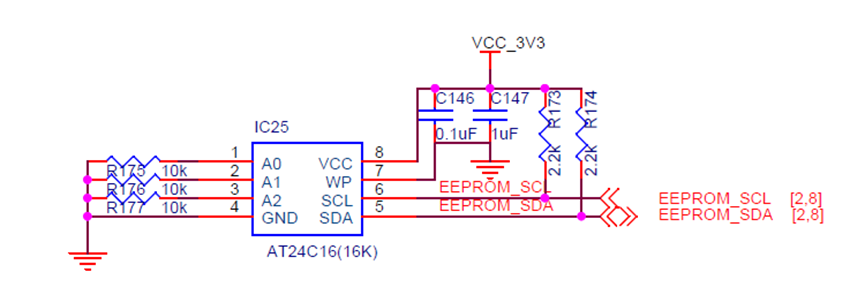
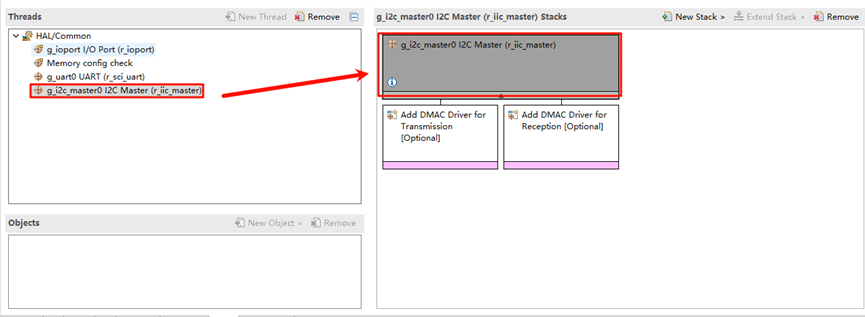
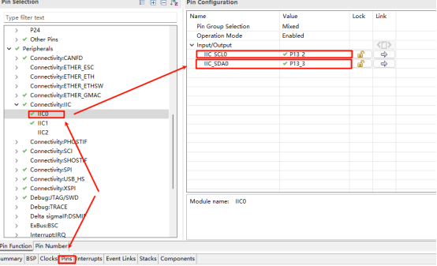
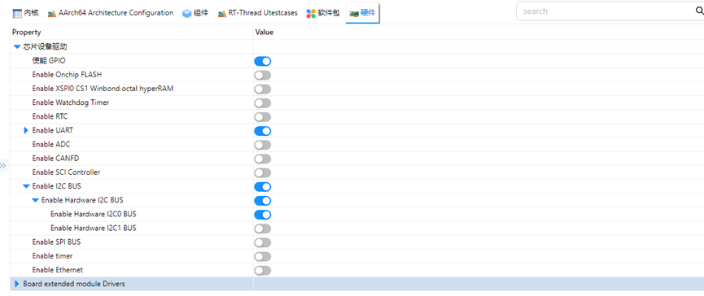
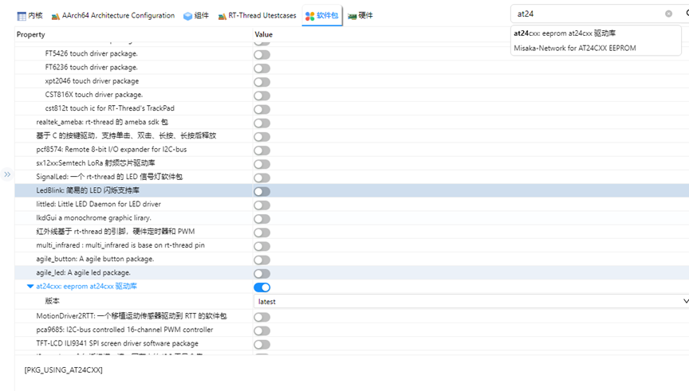
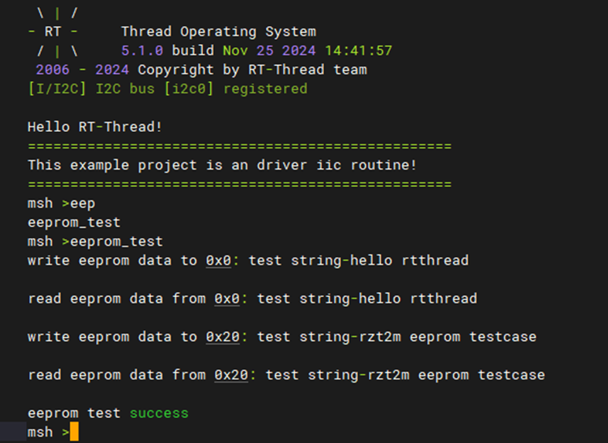

# RZ EtherKit Development Board EEPROM Example Usage Instructions

**English** | [**中文**](./README_zh.md)

## Introduction

This example demonstrates how to use the RT-Thread I2C framework on the EtherKit to perform read and write operations on the onboard EEPROM.

## Hardware Description

The EEPROM used on the EtherKit is an AT24C16, which is connected to the I2C0 of the R9A07G084M08GBG chip.



## FSP Configuration Instructions

Create a new stack and select `r_iic_master`. Then, configure the I2C0 settings as shown below:





## RT-Thread Settings Configuration

Enable the RT-Thread I2C driver framework and the AT24C16 driver software package in the configuration.





## Example Project Description

The example uses the AT24C16 driver package to perform read and write operations at EEPROM addresses `0x00` and `0x20`.

```c
#ifdef PKG_USING_AT24CXX
#include "at24cxx.h"
#define EEPROM_I2C_NAME "i2c0"
static at24cxx_device_t at24c02_dev;
static void eeprom_test(void)
{
    char str1[] = "test string-hello rtthread\n";
    char str2[] = "test string-rzt2m eeprom testcase\n";
    uint8_t read_buffer1[50];
    uint8_t read_buffer2[50];
    at24c02_dev = at24cxx_init(EEPROM_I2C_NAME, 0x0);
    if (at24c02_dev == RT_NULL)
    {
        rt_kprintf("eeprom init failed\n");
        return;
    }
    rt_memset(read_buffer1, 0x0, sizeof(read_buffer1));
    rt_memset(read_buffer2, 0x0, sizeof(read_buffer2));
    at24cxx_write(at24c02_dev, 0x0, (uint8_t *)str1, (sizeof(str1) - 1));
    rt_kprintf("write eeprom data to 0x0: %s\n", str1);
    rt_thread_mdelay(1000);
    at24cxx_read(at24c02_dev, 0x0, read_buffer1, (sizeof(str1) - 1));
    rt_kprintf("read eeprom data from 0x0: %s\n", read_buffer1);
    at24cxx_write(at24c02_dev, 0x20, (uint8_t *)str2, (sizeof(str2) - 1));
    rt_kprintf("write eeprom data to 0x20: %s\n", str2);
    rt_thread_mdelay(1000);
    at24cxx_read(at24c02_dev, 0x20, read_buffer2, (sizeof(str2) - 1));
    rt_kprintf("read eeprom data from 0x20: %s\n", read_buffer2);
    if (rt_strcmp((const char *)str1, (const char *)read_buffer1) != 0 && rt_strcmp((const char *)str2, (const char *)read_buffer2) != 0)
        rt_kprintf("eeprom test fail\n");
    else
        rt_kprintf("eeprom test success\n");
    at24cxx_deinit(at24c02_dev);
}
MSH_CMD_EXPORT(eeprom_test, eeprom test sample);
#endif
```

## Compilation & Download

* **RT-Thread Studio**: In RT-Thread Studio’s package manager, download the EtherKit resource package, create a new project, and compile it.
* **IAR**: First, double-click `mklinks.bat` to create symbolic links between RT-Thread and the libraries folder. Then, use the `Env` tool to generate the IAR project. Finally, double-click `project.eww` to open the IAR project and compile it.

After compilation, connect the development board’s JLink interface to the PC and download the firmware to the development board.

## Run Effect

To test the EEPROM, enter the `eeprom_test` command in the serial terminal:

