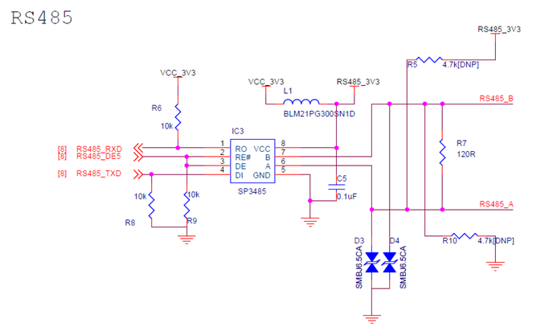
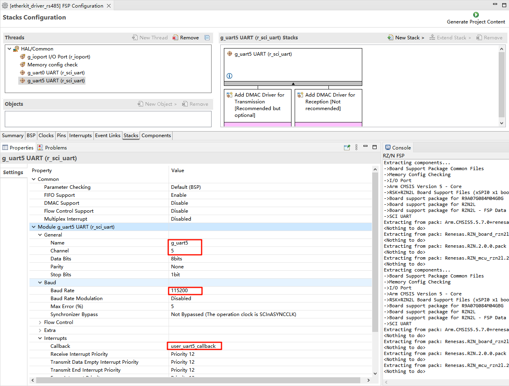

# RS485 Driver Usage Instructions

**English** | [**中文**](./README_zh.md)

## Introduction

This example demonstrates how to use an RS485 device on the EtherKit.

## Hardware Overview

## FSP Configuration

Open the FSP tool, create a new Stack, and select **r_sci_uart5**. The specific configuration details are as follows:

## Example Project Description

The RS485 driver is initialized, and characters received from the RS485 serial terminal are printed to the Finsh terminal, while being echoed back to the RS485 terminal.

## Build & Download

* **RT-Thread Studio:** Download the EtherKit resource pack from the RT-Thread Studio package manager, then create a new project and compile it.
* **IAR:** First, double-click `mklinks.bat` to generate links for the `rt-thread` and `libraries` folders. Then, use Env to generate the IAR project. Finally, double-click `project.eww` to open the IAR project and compile it.

Once compiled, connect the development board’s JLink interface to the PC, and download the firmware to the development board.

### Running Result

Run the `rs485_sample` command in the serial console, and open the RS485 serial terminal to view the received data:

