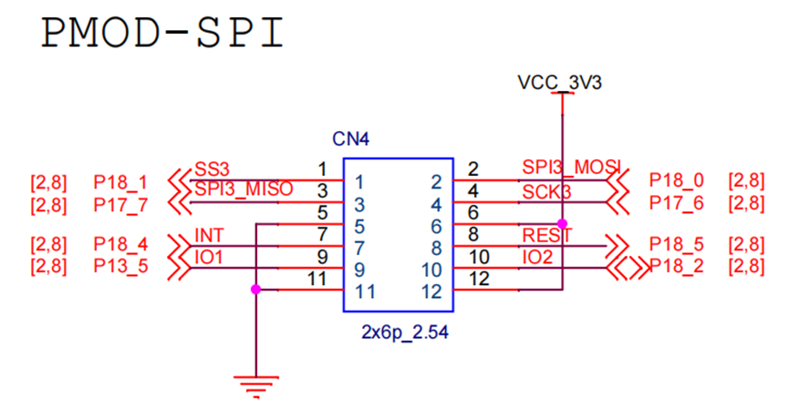
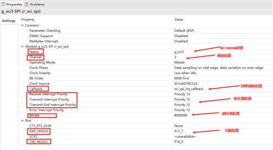
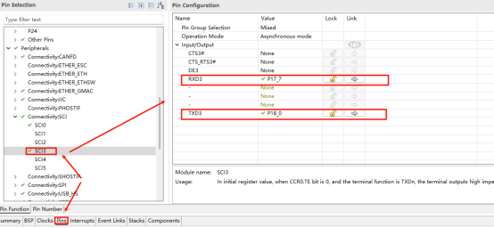
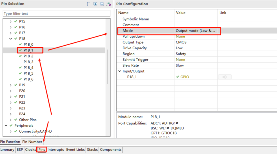

# SCI_SPI Driver Usage Instructions

**English** | [**中文**](./README_zh.md)

## Introduction

This example demonstrates how to use the RT-Thread SCI_SPI framework on the EtherKit.

## Hardware Description

The EtherKit board has a PMOD interface, which is connected to the SCI_SPI3 of the R9A07G084M08GBG chip.



## FSP Configuration Instructions

Open the FSP tool, create a new stack, and select `r_sci_spi3`:








## RT-Thread Settings Configuration

In RT-Thread Settings, enable SCI hardware and configure SCI3 mode as SPI:


## Example Project Description

This example uses the RT-Thread SCI driver framework to perform a loopback test on the PMOD interface (connecting PMOD's SPI3_MOSI to SPI3_MISO). The code is as follows:

```c
void spi_loop_test(void)
{
#define TEXT_NUMBER_SIZE 1024
#define SPI_BUS_NAME "sci3s"
#define SPI_NAME "spi30"
    static uint8_t sendbuf[TEXT_NUMBER_SIZE] = {0};
    static uint8_t readbuf[TEXT_NUMBER_SIZE] = {0};
    for (int i = 0; i < sizeof(readbuf); i++)
    {
        sendbuf[i] = i;
    }
    static struct rt_spi_device *spi_dev = RT_NULL;
    struct rt_spi_configuration cfg;
    rt_hw_sci_spi_device_attach(SPI_BUS_NAME, SPI_NAME, NULL);
    cfg.data_width = 8;
    cfg.mode = RT_SPI_MASTER | RT_SPI_MODE_0 | RT_SPI_MSB | RT_SPI_NO_CS;
    cfg.max_hz = 1 * 1000 * 1000;
    spi_dev = (struct rt_spi_device *)rt_device_find(SPI_NAME);
    if (RT_NULL == spi_dev)
    {
        rt_kprintf("spi sample run failed! can't find %s device!\n", SPI_NAME);
        return;
    }
    rt_spi_configure(spi_dev, &cfg);
    rt_kprintf("%s send:\n", SPI_NAME);
    for (int i = 0; i < sizeof(sendbuf); i++)
    {
        rt_kprintf("%02x ", sendbuf[i]);
    }
    rt_spi_transfer(spi_dev, sendbuf, readbuf, sizeof(sendbuf));
    rt_kprintf("\n\n%s rcv:\n", SPI_NAME);
    for (int i = 0; i < sizeof(readbuf); i++)
    {
        if (readbuf[i] != sendbuf[i])
        {
            rt_kprintf("SPI test fail!!!\n");
            break;
        }
        else
            rt_kprintf("%02x ", readbuf[i]);
    }
    rt_kprintf("\n\n");
    rt_kprintf("SPI test end\n");
}
```

## Compilation & Download

* **RT-Thread Studio**: In RT-Thread Studio’s package manager, download the EtherKit resource package, create a new project, and compile it.
* **IAR**: First, double-click `mklinks.bat` to create symbolic links between RT-Thread and the libraries folder. Then, use the `Env` tool to generate the IAR project. Finally, double-click `project.eww` to open the IAR project and compile it.

After compilation, connect the development board’s JLink interface to the PC and download the firmware to the development board.

## Run Effect

When using a serial tool, you can observe that the data sent and received in the SPI loopback test matches:

