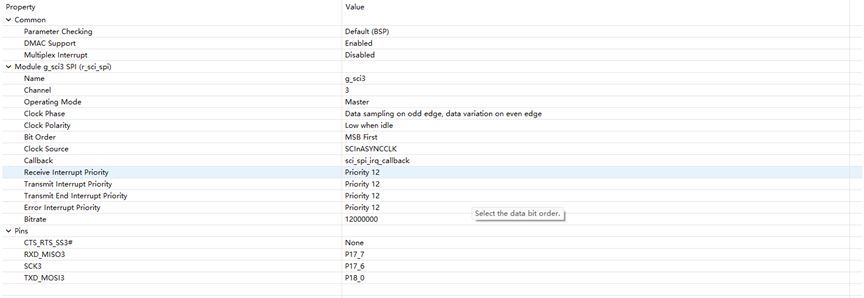
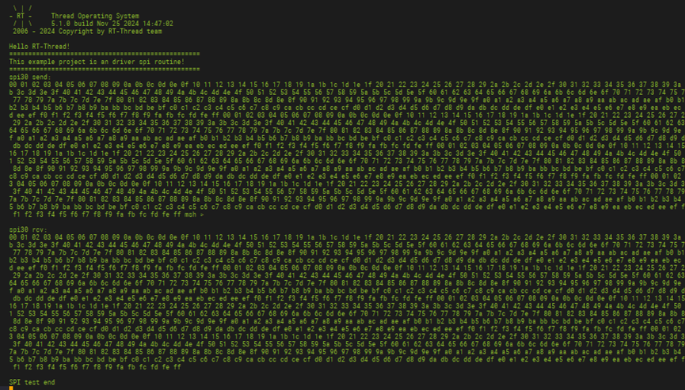

# RZ EtherKit 开发板 SCI_SPI 使用说明

**中文** | [**English**](./README.md)

## 简介

本例程主要介绍了如何在EtherKit上使用RT-Thread的SCI_SPI框架;

## 硬件说明

EtherKit 板载资源有PMOD接口，连接到R9A07G084M08GBG 芯片的SCI_SPI3；


## FSP配置说明

打开FSP工具，新建 Stacks 并选择 r_sci_spi3：



## RT-Thread Settings配置

打开RT-Thread Settings，硬件选择SCI，并配置SCI3模式为SPI：


## 示例工程介绍

基于RT-Thread的SCI驱动框架实现对PMODE的loop回环测试（将PMOD的SPI3_MOSI 连接到SPI3_MISO），代码如下：

```c
void spi_loop_test(void)
{
#define TEXT_NUMBER_SIZE 1024
#define SPI_BUS_NAME "sci3s"
#define SPI_NAME "spi30"
    static uint8_t sendbuf[TEXT_NUMBER_SIZE] = {0};
    static uint8_t readbuf[TEXT_NUMBER_SIZE] = {0};
    for (int i = 0; i < sizeof(readbuf); i++)
    {
        sendbuf[i] = i;
    }
    static struct rt_spi_device *spi_dev = RT_NULL;
    struct rt_spi_configuration cfg;
    rt_hw_sci_spi_device_attach(SPI_BUS_NAME, SPI_NAME, NULL);
    cfg.data_width = 8;
    cfg.mode = RT_SPI_MASTER | RT_SPI_MODE_0 | RT_SPI_MSB | RT_SPI_NO_CS;
    cfg.max_hz = 1 * 1000 * 1000;
    spi_dev = (struct rt_spi_device *)rt_device_find(SPI_NAME);
    if (RT_NULL == spi_dev)
    {
        rt_kprintf("spi sample run failed! can't find %s device!\n", SPI_NAME);
        return;
    }
    rt_spi_configure(spi_dev, &cfg);
    rt_kprintf("%s send:\n", SPI_NAME);
    for (int i = 0; i < sizeof(sendbuf); i++)
    {
        rt_kprintf("%02x ", sendbuf[i]);
    }
    rt_spi_transfer(spi_dev, sendbuf, readbuf, sizeof(sendbuf));
    rt_kprintf("\n\n%s rcv:\n", SPI_NAME);
    for (int i = 0; i < sizeof(readbuf); i++)
    {
        if (readbuf[i] != sendbuf[i])
        {
            rt_kprintf("SPI test fail!!!\n");
            break;
        }
        else
            rt_kprintf("%02x ", readbuf[i]);
    }
    rt_kprintf("\n\n");
    rt_kprintf("SPI test end\n");
}
```

## 编译&下载

* RT-Thread Studio：在RT-Thread Studio 的包管理器中下载EtherKit 资源包，然后创建新工程，执行编译。
* IAR：首先双击mklinks.bat，生成rt-thread与libraries 文件夹链接；再使用Env 生成IAR工程；最后双击project.eww打开IAR工程，执行编译。

编译完成后，将开发板的Jlink接口与PC 机连接，然后将固件下载至开发板。

## 运行效果

打开串口工具，可以看到通过spi回环测试中发送的数据与接收数据一致：


