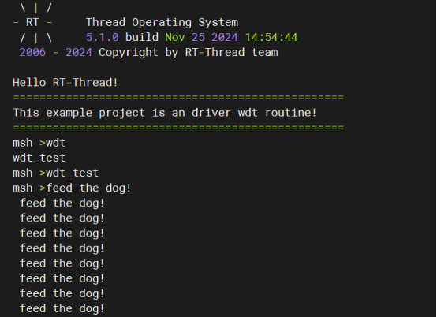

# WDT Driver Usage Instructions

**English** | **[Chinese](./README_zh.md)**

## Introduction

This example mainly introduces how to use the WDT (Watchdog Timer) device on the EtherKit.

## Hardware Description

None

## Software Description

### FSP Configuration Instructions

Open the FSP tool and create a new stack, selecting `r_wdt`.

### RT-Thread Settings Configuration


## Example project description

By performing a watchdog operation in the idle function, we ensure that our program runs as expected.

```c
static void idle_hook(void)
{
    /* 在空闲线程的回调函数里喂狗 */
    rt_device_control(wdg_dev, RT_DEVICE_CTRL_WDT_KEEPALIVE, NULL);
    rt_kprintf("feed the dog!\n ");
}
```

```c
static int wdt_test(int argc, char *argv[])
{
    rt_err_t ret = RT_EOK;
    char device_name[RT_NAME_MAX];
    /* 判断命令行参数是否给定了设备名称 */
    if (argc == 2)
    {
        rt_strncpy(device_name, argv[1], RT_NAME_MAX);
    }
}
```

## Running

### Compilation & Download

**RT-Thread Studio**: Download the EtherKit resource package in the RT-Thread Studio package manager, then create a new project and compile it.

**IAR**: First, double-click `mklinks.bat` to generate links for the rt-thread and libraries folders; then use Env to generate the IAR project; finally, double-click `project.eww` to open the IAR project and compile it.

After compilation, connect the Jlink interface of the development board to the PC, and download the firmware to the development board.

### Running Effects



## Notes

None

## References

Device and Driver: [WDT Device](https://www.rt-thread.org/document/site/#/rt-thread-version/rt-thread-standard/programming-manual/device/watchdog/watchdog)