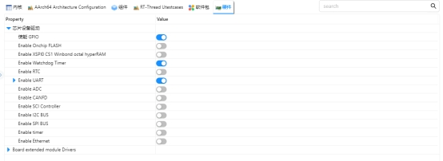

# RZ EtherKit 开发板 使用 WDT 说明

**中文** | [**English**](./README.md)

## 简介

看门狗设备可以保证我们的代码在我们的预期中进行，可以有效防止我们的程序因为一些其它不可控因素导致代码”跑飞“；本例程主要介绍了如何在EtherKit上使用窗口WDT设备;

## 硬件说明

无

## 软件说明

### FSP配置说明

打开FSP工具 新建Stacks选择r_wdt

### RT-Thread Settings配置

 

## 示例工程说明

通过在空闲函数中执行喂狗操作来保证我们的程序如期运转;

```c
static void idle_hook(void)
{
    /* 在空闲线程的回调函数里喂狗 */
    rt_device_control(wdg_dev, RT_DEVICE_CTRL_WDT_KEEPALIVE, NULL);
    rt_kprintf("feed the dog!\n ");
}
```

```c
static int wdt_test(int argc, char *argv[])
{
    rt_err_t ret = RT_EOK;
    char device_name[RT_NAME_MAX];
    /* 判断命令行参数是否给定了设备名称 */
    if (argc == 2)
    {
        rt_strncpy(device_name, argv[1], RT_NAME_MAX);
    }
}
```


## 运行

### 编译&下载

l RT-Thread Studio：在RT-Thread Studio 的包管理器中下载EtherKit 资源包，然后创建新工程，执行编译。

l IAR：首先双击mklinks.bat，生成rt-thread与libraries 文件夹链接；再使用Env 生成IAR工程；最后双击project.eww打开IAR工程，执行编译。

编译完成后，将开发板的Jlink接口与PC 机连接，然后将固件下载至开发板。

### 运行效果

 

## 注意事项

​	暂无

## 引用参考

设备与驱动：[WDT 设备](https://www.rt-thread.org/document/site/#/rt-thread-version/rt-thread-standard/programming-manual/device/watchdog/watchdog)

 

