# EtherCAT CoE Usage Instructions

**English** | [**中文**](./README_zh.md)

## Introduction

EtherCAT CoE (**CAN over EtherCAT**) is a communication protocol within the EtherCAT protocol that integrates the CANopen application layer protocol into the EtherCAT network for device control and data exchange in distributed systems. It combines the ease of use of CANopen with the high performance of EtherCAT, making it widely used in industrial automation, motion control, and sensor networks.

The following are the main features and functions of CoE:

**Based on CANopen**:

- The CoE application layer directly adopts the device protocol of CANopen, including the structure and services of the Object Dictionary.
- Device parameters, communication objects, and control data are defined via the Object Dictionary, ensuring interoperability between devices.

**Supports Standard Services**:

- **SDO (Service Data Object)**: Used for point-to-point configuration and diagnostic communication, allowing the master to exchange large amounts of data (e.g., parameter configuration) with the slave.
- **PDO (Process Data Object)**: Used for real-time communication, transmitting small amounts of periodic process data with quick response times.
- **Emergency (EMCY) Messages**: Used to report abnormal device conditions.
- **NMT (Network Management)**: Provides network management functions such as starting, stopping, and resetting devices.

**Efficient Data Transfer**:

- The EtherCAT bus structure and high-speed frame processing capabilities allow CoE to exchange data with lower latency and higher efficiency.

**Supports Various Application Scenarios**:

- Suitable for industrial equipment configuration, real-time monitoring, parameter diagnostics, and system integration.

**Object Dictionary Mapping**:

- The Object Dictionary organizes device data and functions in a hierarchical structure.
- EtherCAT uses the CoE protocol to access variables in the Object Dictionary for parameter reading, writing, and real-time control.

**Typical Applications**:

- Used in drives (e.g., servo drives) supporting complex control logic.
- Used in engineering tools for monitoring, debugging, and configuring devices.

This section demonstrates how to implement EtherCAT CoE master-slave communication using Beckhoff TwinCAT3 and the EtherKit development board. The example project supports both CSP and CSV operating modes.

## Preliminary Setup

**Software Environment**:

- [RT-Thread Studio](https://download-redirect.rt-thread.org/download/studio/RT-Thread Studio_2.2.8-setup-x86_64_202405200930.exe)
- [RZN-FSP v2.0.0](https://github.com/renesas/rzn-fsp/releases/download/v2.0.0/setup_rznfsp_v2_0_0_rzsc_v2024-01.1.exe)
- [Beckhoff Automation TwinCAT3](https://www.beckhoff.com/en-us/support/download-finder/search-result/?c-1=26782567)

**Hardware Environment**:

- EtherKit Development Board
- One Ethernet Cable
- Jlink Debugger

## TwinCAT3 Configuration

> Before starting TwinCAT3, we need to perform some configuration tasks:

### Install ESI Files

Before starting TwinCAT, copy the ESI files contained in the release folder to the TwinCAT target directory: **..\TwinCAT\3.x\Config\IO\EtherCAT**

> Note: The current version of the ESI file is located at: ..\board\ports\ESI_File\Renesas EtherCAT RZN2 CoE CDP.xml


### Add TwinCAT Ethernet Driver

Add the TwinCAT Ethernet driver (this step is only needed for the initial setup); from the Start menu, select [TwinCAT] → [Show Realtime Ethernet Compatible Devices…], choose the connected Ethernet port from the communication port list and install it.


Here we can see all the Ethernet adapters on the PC. Select the port you will be testing with, then click Install:


After checking the network adapter, we can see that the installation was successful:


## FSP Configuration Instructions

Next, we proceed with the pin initialization configuration. Open the installed RZN-FSP 2.0.0 and select the root directory of our project:


We configure the peripherals and pins as follows: click New Stack and add the ethercat_ssc_port peripheral:


Configure ethercat_ssc_port: modify the Reset Port to P13_4, and set the EEPROM_Size to Under 32Kbits:


Enable the Ethernet card type and configure the Ethernet device parameters. Here, we add two PHYs (phy0 and phy1). It should be noted that EtherKit uses the RTL8211 Ethernet card, which is not supported by the Renesas FSP. However, Renesas has reserved user-defined network interfaces, so we configure the network card as follows and set the MDIO type to GMAC, with the network card initialization callback function `phy_rtl8211f_initial();`:


Configure the network card pin parameters and set the operating mode to RGMII:


ETHER_ESC Settings:

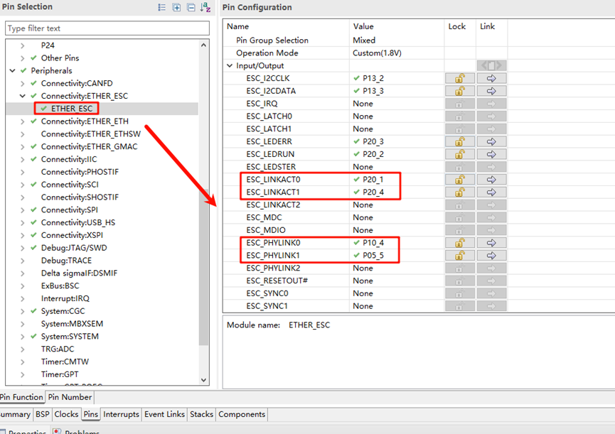

ETHER_GMAC Configuration:


Add a CMT timer to ethercat_ssc_port and configure the interrupt priority:


Finally, click Generate Project Content to generate the low-level driver source code.

## Build Configuration

1. Modify the `sconscript`: Enter the project and find the file at the specified path: `.\rzn\SConscript`, and replace it with the following content:

```c
Import('RTT_ROOT')
Import('rtconfig')
from building import *
from gcc import *

cwd = GetCurrentDir()
src = []
group = []
CPPPATH = []

if rtconfig.PLATFORM in ['iccarm'] + GetGCCLikePLATFORM():
    if rtconfig.PLATFORM == 'iccarm' or GetOption('target') != 'mdk5':
        src += Glob('./fsp/src/bsp/mcu/all/*.c')
        src += Glob('./fsp/src/bsp/mcu/all/cr/*.c')
        src += Glob('./fsp/src/bsp/mcu/r*/*.c')
        src += Glob('./fsp/src/bsp/cmsis/Device/RENESAS/Source/*.c')
        src += Glob('./fsp/src/bsp/cmsis/Device/RENESAS/Source/cr/*.c')
        src += Glob('./fsp/src/r_*/*.c')
        CPPPATH = [ cwd + '/arm/CMSIS_5/CMSIS/Core_R/Include',
                            cwd + '/fsp/inc',
                            cwd + '/fsp/inc/api',
                            cwd + '/fsp/inc/instances',]

if GetDepend('BSP_USING_COE_IO'):
    src += Glob('./fsp/src/rm_ethercat_ssc_port/*.c')
    CPPPATH += [cwd + '/fsp/src/rm_ethercat_ssc_port']

group = DefineGroup('rzn', src, depend = [''], CPPPATH = CPPPATH)
Return('group')
```

2. Modify Kconfig: Open the file under the project directory (projects\etherkit_ethercat_coe\board\Kconfig), and add the CoE configuration under the Onboard Peripheral Drivers option:

```c
        config BSP_USING_COE_IO
            bool "Enable EtherCAT COE_IO"
            default y
        config COE_DUMMY_LOG
            bool "Enable CoE dummy motor printf"
            default n
```

As shown below:

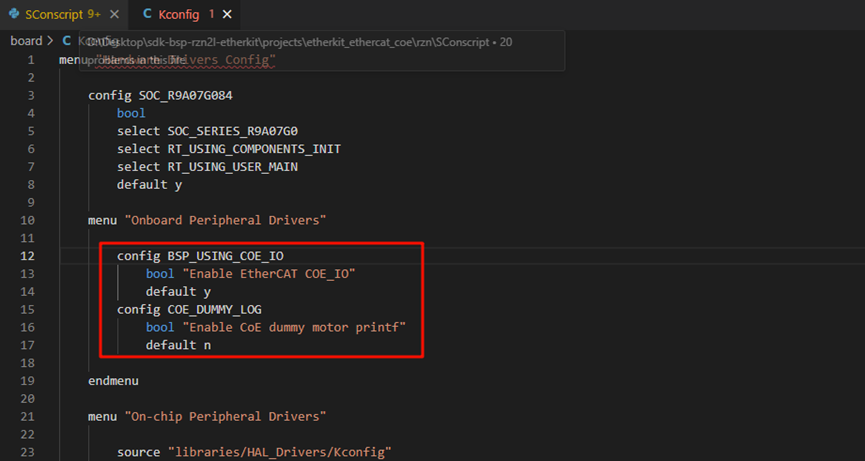

3. If using Studio for development, right-click the project and select **Sync Scons Configuration to Project**; if using IAR, right-click the project folder and execute: `scons –target=iar` to regenerate the configuration.

## RT-Thread Studio Configuration

After completing the FSP configuration, the pin and peripheral initialization is mostly complete. Next, we need to enable the EtherCAT EOE example. Open Studio, click RT-Thread Settings, and enable the EOE example:

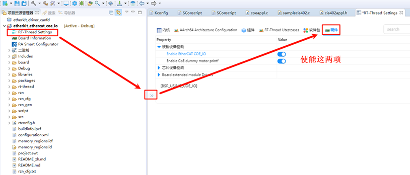

## EtherCAT CoE Configuration

### Create a New TwinCAT Project

Open TwinCAT software, click File -> New -> New Project, select TwinCAT Projects, and create a TwinCAT XAR Project (XML format):


### Slave Startup CoE App

After powering up the EtherKit development board, use an Ethernet cable to connect to the ETH0 port. EtherCAT will run by default.


### Slave Device Scanning

After creating a new project, find **Devices** in the left navigation bar, right-click, and select **Scan for devices**. Normally, if scanning the slave device is successful, it will show: **Device x[EtherCAT]**. If the scan fails, it will show: **Device x[EtherCAT Automation Protocol]**, indicating that the slave initialization has failed.


Click **Ok** and a window will pop up: **Scan for boxes**. After confirming, another window will pop up: **Activate Free Run**. Since we are using CoE for the first time and need to update the EEPROM firmware, we will not activate it for now.

### Update EEPROM Firmware

Return to TwinCAT. In the left navigation bar, since we have successfully scanned the slave device, the master-slave configuration interface is now visible:


Double-click **Box 1** and in the top navigation bar of the middle interface, click **EtherCAT** and then click **Advanced Settings…**:

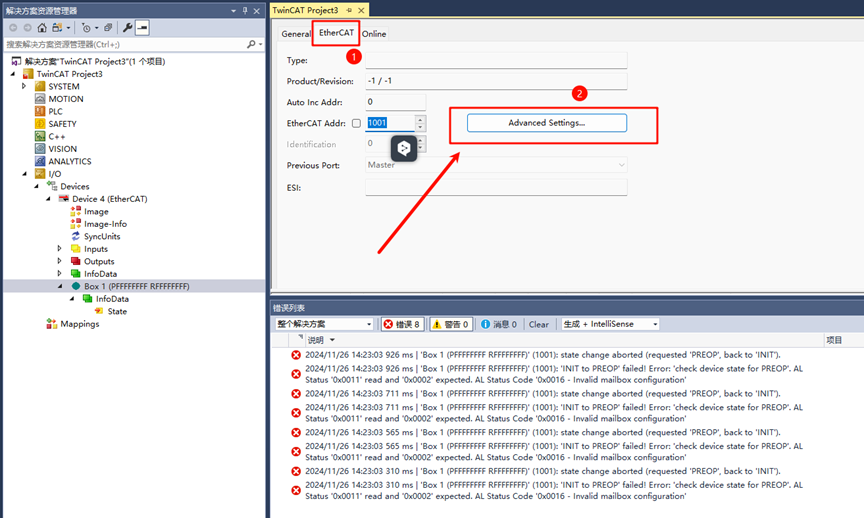

Click **Download from List…** as shown in the image below:

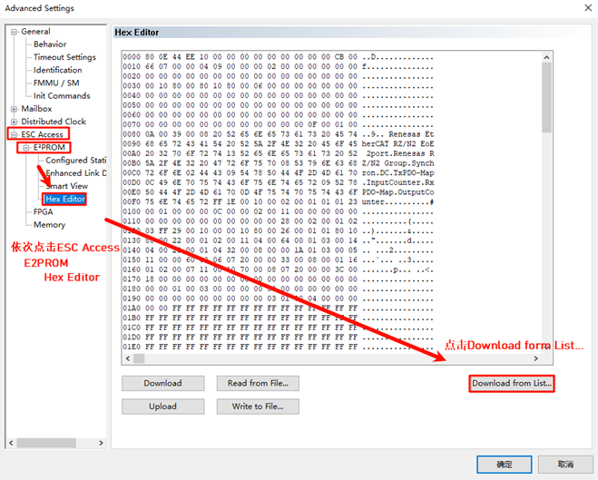

We will write the ESI firmware to the EEPROM. Since we are using a dual Ethernet port configuration, select **Renesas EtherCAT RZ/N2 COE 2port**. If you are using a three-port configuration, select the ESI file with the **3port** suffix for download.


After the download is complete, right-click **Device x(EtherCAT)**, remove the device, rescan, and add the device back. Finally, complete the activation process (as mentioned above).


## CiA402 Servo Usage Instructions

First, let’s look at the CiA402 protocol: The CiA402 protocol (Communication Interface for Drive Systems) is defined by the CiA (CAN in Automation) organization and is a standardized protocol used in industrial automation, especially for motor control systems. CiA402 is the drive and motion controller sub-protocol for CANopen, defining the interface for inverters, servo controllers, and stepper motors. It is part of the international standard IEC 61800-7 series. The CiA402 protocol is based on the CANopen communication protocol and extends and optimizes the functionality for motion control systems. It is mainly used for controlling servo motors, stepper motors, and other types of electric drive systems.

Next, we look at the FSA (Finite State Automaton) showing different states of the drive and how to perform transitions between them.


Below is a detailed description of each state from the above diagram:

| **State**        | **Description**                                               |
| ---------------- | ------------------------------------------------------------- |
| Initialization   | Servo initialization: Parameters cannot be set, and drive commands cannot be executed. |
| Initialization Complete | Servo initialization complete, parameters can be set.  |
| Servo Ready      | The main power is on, and servo parameters can be set, but the drive is in a deactivated state. |
| Waiting for Servo Enable | Main power is OK, parameters can be set, waiting for servo enable. |
| Servo Enabled    | Servo is enabled and running according to the set mode.      |
| Quick Stop Active | Quick stop function is active, the drive is performing a quick stop function. |
| Fault Stop       | Drive has encountered a fault, performing fault stop procedure. |
| Alarm State      | Fault stop is complete, all drive functions are disabled, but the parameters can be changed to troubleshoot the fault. |

For the controller, in each communication cycle, the master station sends a **Control Word** to the slave station and receives the **Status Word** from the slave to confirm its status. For example, in this project, the state transitions of CiA402 are implemented through **CiA402_StateMachine()**:

```c
/*---------------------------------------------
-    CiA402 State machine
-----------------------------------------------*/
#define STATE_NOT_READY_TO_SWITCH_ON        0x0001 /**< \brief Not ready to switch on (optional)*/
#define STATE_SWITCH_ON_DISABLED            0x0002 /**< \brief Switch on but disabled (optional)*/
#define STATE_READY_TO_SWITCH_ON            0x0004 /**< \brief Ready to switch on (mandatory)*/
#define STATE_SWITCHED_ON                   0x0008 /**< \brief Switch on (mandatory)*/
#define STATE_OPERATION_ENABLED             0x0010 /**< \brief Operation enabled (mandatory)*/
#define STATE_QUICK_STOP_ACTIVE             0x0020 /**< \brief Quick stop active (optional)*/
#define STATE_FAULT_REACTION_ACTIVE         0x0040 /**< \brief Fault reaction active (mandatory)*/
#define STATE_FAULT                         0x0080 /**< \brief Fault state (mandatory)*/
```

Meanwhile, the master station reads the **Status Word** (0x6041) from the slave to understand the current running state of the slave. Through the **Status Word**, the master can obtain detailed information about the current state of the slave and any potential faults or warnings:


The master station sends control commands to the slave using the **Control Word** (0x6040) to change its operational state or trigger specific actions:


## CiA402 Object Dictionary Definition

Below is a list of CiA402 object dictionary items supported in the EtherKit CoE project. The position mode and speed mode are supported, and the master station can interact with the slave’s process data by setting the control word, completing read and write operations based on the CoE protocol:

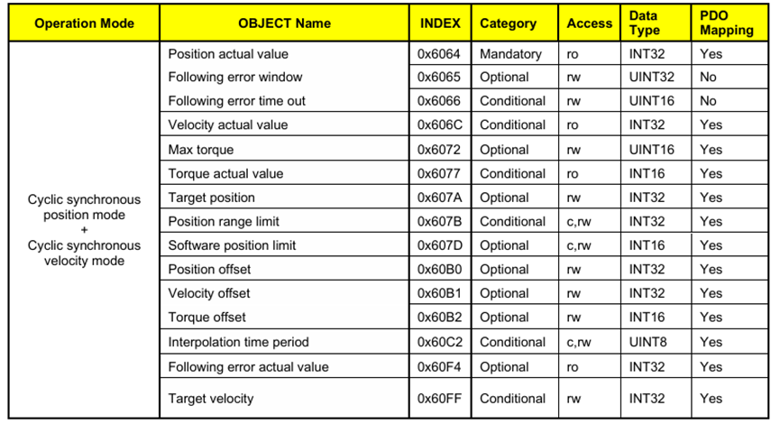

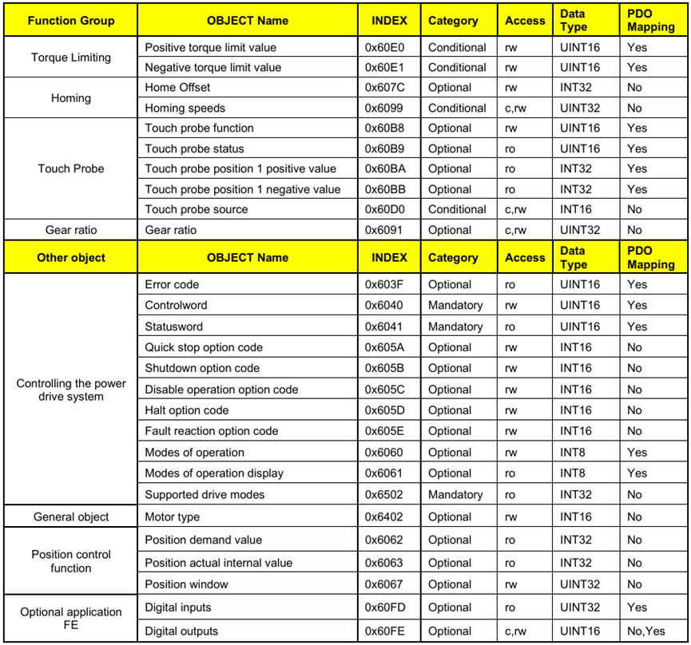

## EtherCAT CoE Testing

First, ensure that the program has been successfully downloaded to the project, and the ESI file has been successfully programmed. Below is the terminal output from the development board’s serial port:


Next, open the previously created ESC project and scan for devices. The system will pop up **EtherCAT drive(s) added**. Select **NC – configuration**, click **OK**, and activate the device:


After activation, the EtherCAT state machine will go through **Init → Pre-Op → Safe-Op**, and finally to **Op (Operational)**. The EtherKit CoE project by default enables **csp** (Cyclic Synchronous Position Mode) and supports **csv** (Cyclic Synchronous Velocity Mode).

When the system is powered on, the drive will automatically complete the initialization and enter the **STATE_SWITCH_ON_DISABLED** state. At this point, you can set the operating mode of the drive, such as setting it to **csp** or **csv** mode. Meanwhile, the CiA402 state machine information for **Axis 1** will be continuously printed on the development board:


### csp Position Mode Control

Let’s take a look at the controller in **csp** mode. In position mode, you can set the target position by writing the desired position to the control word **0x607A**, and the actual feedback position can be obtained via the status word **0x6064**.

To operate in **csp** or **csv** mode, you must first change the state to **STATE_OPERATION_ENABLED** (operational mode).

Expand the left navigation bar and click **Box 1 (Renesas EtherCAT RZ/N2 CoE 2port) → Module 1 (csp - axis) → Outputs → Control Word**. First, switch the state to **Servo Fault Free Mode** by writing **0x0080** (dec: 128) to control word **0x6040**. This changes the servo controller to an unobstructed state:


At this point, you will see that the serial terminal on the slave will stop printing **State Transition2** and **State Transition7**. Then, write **0x000F** (dec: 15) to control word **0x6040**:


The servo controller will transition from waiting for servo enable to the **Servo Running** state. Meanwhile, the slave's serial terminal will print **State Transition2**, **State Transition3**, and **State Transition4**. After these state transitions, the CiA402 state machine

 will enter **STATE_OPERATION_ENABLED**, and the controller can now be controlled.

For example, in position mode, write a position value (e.g., **100000**) to **Index: 0x607A**:

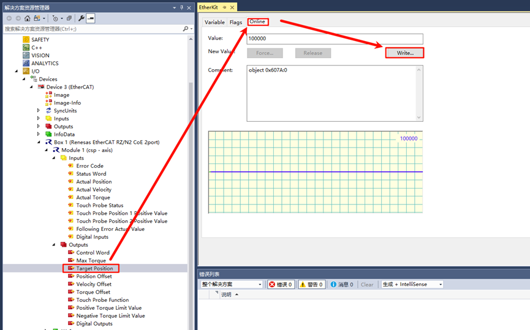

Then, click **Box 1 (Renesas EtherCAT RZ/N2 CoE 2port) → Module 1 (csp - axis) → Inputs → Actual Position** to view the actual feedback position. You will see that the value of **Index 0x6064** increases incrementally until it reaches **100000**:


### csv Speed Mode Control

First, switch the controller mode from **csp** to **csv** mode. Click **Box 1 (Renesas EtherCAT RZ/N2 CoE 2port)** in the left navigation bar, then find **Axis 0** in the middle panel, and change the supported module to **csv**. Click the **<** symbol:

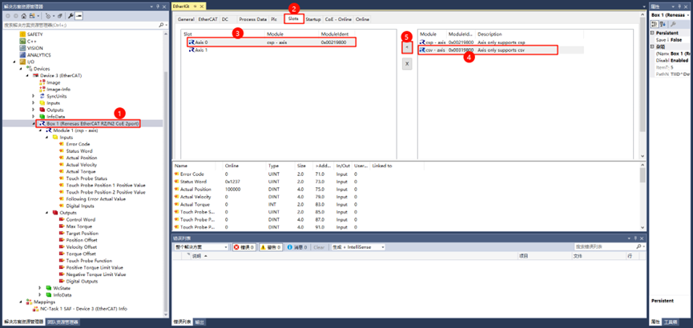

Observe if the module information on the left has been updated to **csv** mode:

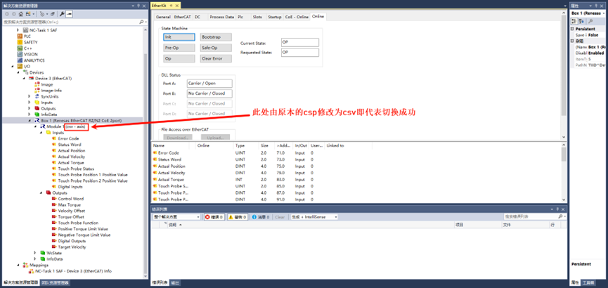

Once the mode has been switched, reload the device by clicking **TwinCAT → Reload Devices** in the top navigation bar:

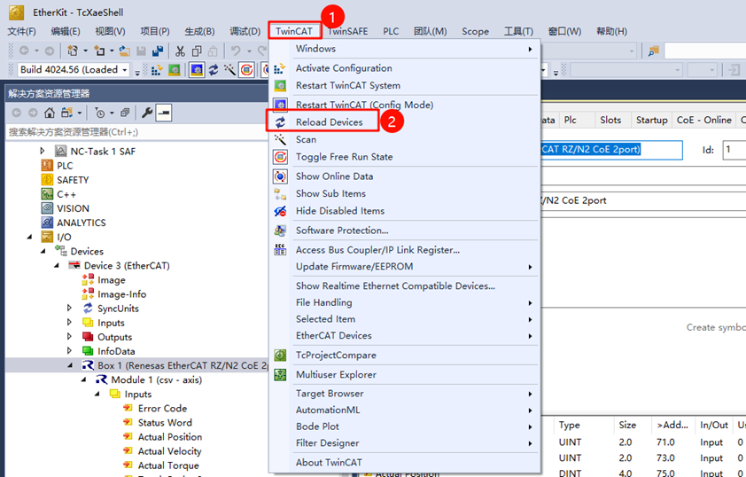

Now, switch the controller to **STATE_OPERATION_ENABLED** (operational mode, as mentioned above). Write **0x0080** (dec: 128) to change the state to an unobstructed state, then write **0x000F** (dec: 15) to transition from waiting for servo enable to servo running state.

Next, check the **Status Word (0x6041)**. If the value is **0x1237**, it indicates that the system is in **STATE_OPERATION_ENABLED**. If the value is **0x1208**, it indicates that the status is in **Fault**. Reconfigure the control word to **0x0080** (dec: 128) and repeat the above operations.

Now you can write the **Target Velocity** value to control the speed:


Also, check the actual set speed information in the inputs to ensure it is consistent:

