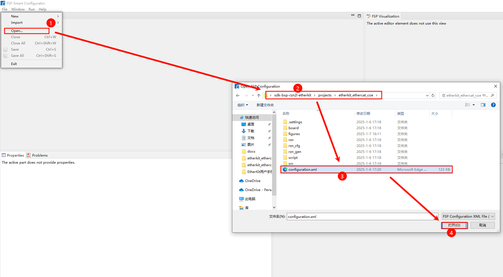
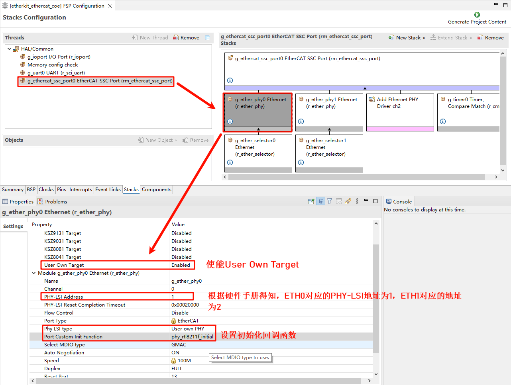
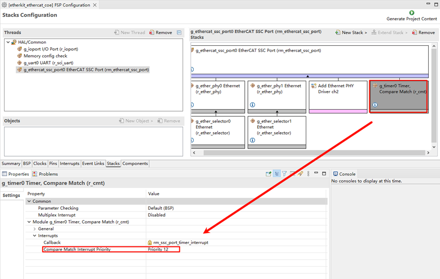
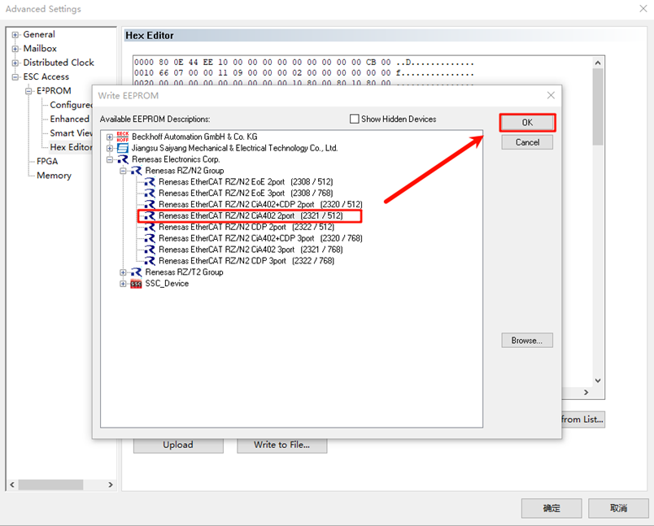
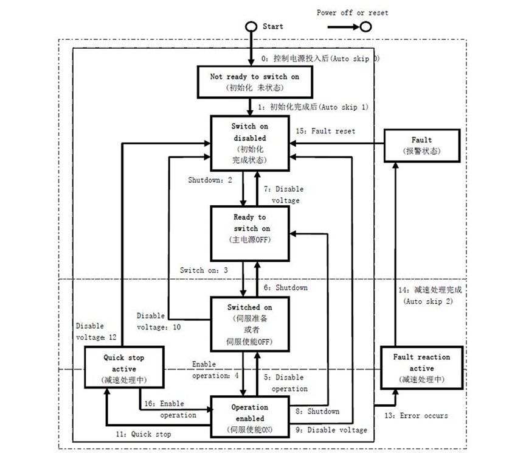
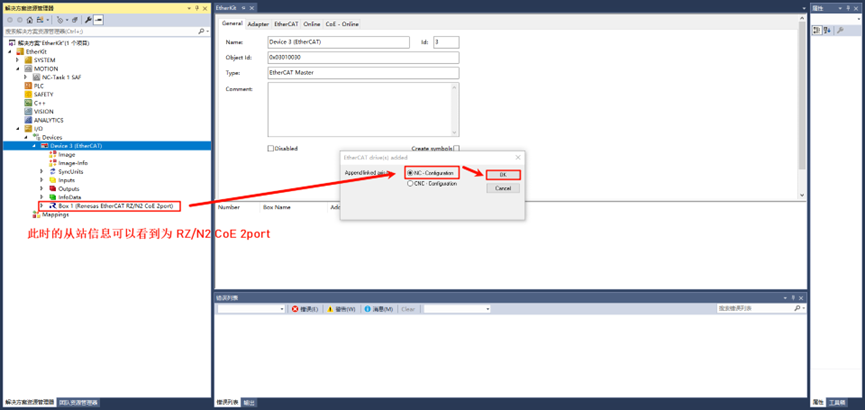
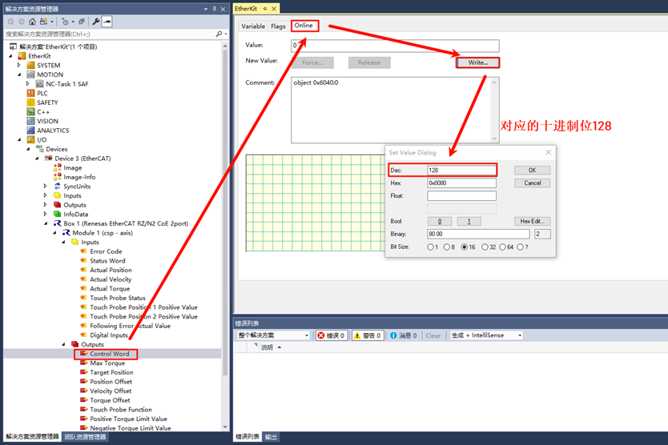
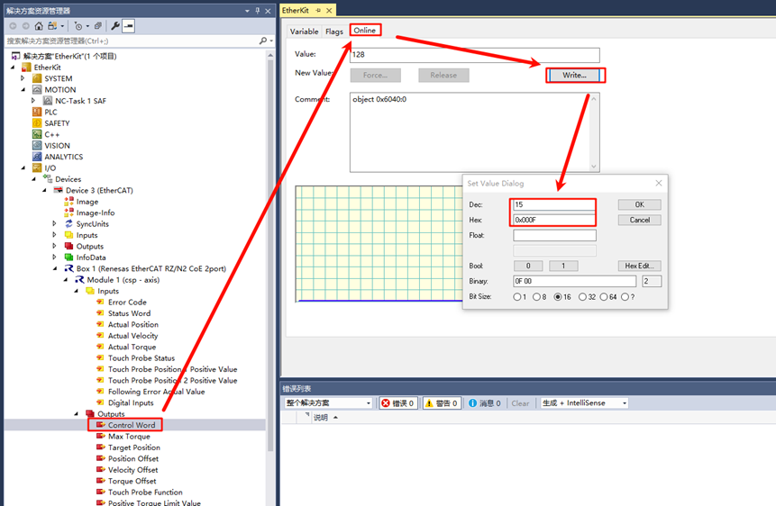
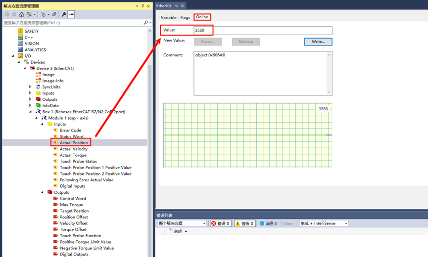
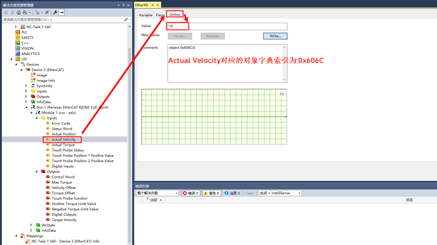

# EtherKit EtherCAT-CoE例程

**中文** | [**English**](./README.md)

## 简介

EtherCAT CoE（**CAN over EtherCAT**）是 EtherCAT 协议中的一种通信协议，它将 CANopen 应用层协议集成到 EtherCAT 网络中，用于分布式系统中的设备控制和数据交换。它结合了 CANopen 的易用性和 EtherCAT 的高性能优势，广泛用于工业自动化、运动控制和传感器网络等领域。

以下是 CoE 的主要特点和功能：

**基于CANopen**：

- CoE 的应用层直接采用了 CANopen 的设备协议，包括对象字典（Object Dictionary）的结构和服务。
- 通过对象字典定义设备参数、通信对象和控制数据，确保了设备间的互操作性。

**支持标准服务**：

- **SDO（Service Data Object）**：用于点对点的配置和诊断通信，允许主站与从站交换大容量数据（如参数配置）。
- **PDO（Process Data Object）**：用于实时通信，传输小数据量的周期性过程数据，支持快速响应。
- **Emergency（EMCY）消息**：用于报告设备异常情况。
- **NMT（Network Management）**：提供网络管理功能，如启动、停止和复位设备。

**高效传输**：

- EtherCAT 的总线结构和高速帧处理能力，使 CoE 能以更低的延迟和更高的效率进行数据交换。

**支持多种应用场景**：

- 适用于工业设备配置、实时监控、参数诊断和系统集成等。

**对象字典映射**：

- 对象字典以层级结构组织设备的数据和功能。
- EtherCAT 使用 CoE 协议访问对象字典中的变量，以实现参数读取、写入和实时控制。

**典型应用**：

- 用于支持复杂控制逻辑的驱动器（如伺服驱动）。
- 用于监控、调试和配置设备的工程工具。

本节将演示如何使用Beckhoff TwinCAT3和EtherKit开发板实现EtherCAT COE主从站通信，该示例工程已支持CSP及CSV两种操作模式。

## 前期准备

软件环境：

- [RT-Thread Studio](https://download-redirect.rt-thread.org/download/studio/RT-Thread Studio_2.2.8-setup-x86_64_202405200930.exe)
- [RZN-FSP v2.0.0](https://github.com/renesas/rzn-fsp/releases/download/v2.0.0/setup_rznfsp_v2_0_0_rzsc_v2024-01.1.exe)
- [Beckhoff Automation TwinCAT3](https://www.beckhoff.com/en-us/support/download-finder/search-result/?c-1=26782567)

硬件环境：

- EtherKit开发板
- 网线一根
- Jlink调试器

## TwinCAT3配置

> 在启动TwinCAT3之前，我们还需要做一些配置操作：

### 安装ESI文件

启动TwinCAT之前，将发布文件夹中包含的ESI文件复制到TwinCAT目标位置：**..\TwinCAT\3.x\Config\IO\EtherCAT**

> 注意：当前版本的 ESI 文件位于：..\board\ports\ESI_File\Renesas EtherCAT RZN2 CoE CDP.xml


### 添加TwinCAT网卡驱动

添加 TwinCAT 的以太网驱动程序（仅限首次使用配置即可）；从开始菜单中，选择 [TwinCAT] → [Show Realtime Ethernet Compatible Devise…]，从通信端口中选择连接的以太网端口并安装。


在这里我们能看到目前PC端的所有以太网适配器信息，选择我们测试要用的端口后，点击安装：


检查网络适配器，可以看到已经成功安装了：


## FSP配置说明

接下来就是引脚初始化配置了，打开安装的RZN-FSP 2.0.0，选择我们工程的根目录：



我们进行以下外设及引脚的配置：点击New Stack，并添加 ethercat_ssc_port 外设：


配置ethercat_ssc_port：修改Reset Port为P13_4，同时EEPROM_Size大小设置为Under 32Kbits；


使能网卡类型、配置网卡设备参数，这里我们添加两个phy（phy0和phy1），其中需要注意的是，EtherKit使用的是rtl8211网卡，并不在瑞萨FSP的支持范围内，但好在瑞萨预留了用户自定义网卡接口，因此按照如下设置来配置网卡，同时设置MDIO类型为GMAC，设置网卡初始化回调函数phy_rtl8211f_initial()（）；



网卡引脚参数配置，选择操作模式为RGMII：


ETHER_ESC设置：


ETHER_GMAC配置：


为ethercat_ssc_port添加cmt定时器并配置中断优先级：



最后点击Generate Project Content生成底层驱动源码。

## 构建配置

1. 修改sconscript：进入工程找到指定路径下的文件：.\rzn\SConscript，替换该文件为如下内容：

```c
Import('RTT_ROOT')
Import('rtconfig')
from building import *
from gcc import *

cwd = GetCurrentDir()
src = []
group = []
CPPPATH = []

if rtconfig.PLATFORM in ['iccarm'] + GetGCCLikePLATFORM():
    if rtconfig.PLATFORM == 'iccarm' or GetOption('target') != 'mdk5':
        src += Glob('./fsp/src/bsp/mcu/all/*.c')
        src += Glob('./fsp/src/bsp/mcu/all/cr/*.c')
        src += Glob('./fsp/src/bsp/mcu/r*/*.c')
        src += Glob('./fsp/src/bsp/cmsis/Device/RENESAS/Source/*.c')
        src += Glob('./fsp/src/bsp/cmsis/Device/RENESAS/Source/cr/*.c')
        src += Glob('./fsp/src/r_*/*.c')
        CPPPATH = [ cwd + '/arm/CMSIS_5/CMSIS/Core_R/Include',
                            cwd + '/fsp/inc',
                            cwd + '/fsp/inc/api',
                            cwd + '/fsp/inc/instances',]

if GetDepend('BSP_USING_COE_IO'):
    src += Glob('./fsp/src/rm_ethercat_ssc_port/*.c')
    CPPPATH += [cwd + '/fsp/src/rm_ethercat_ssc_port']

group = DefineGroup('rzn', src, depend = [''], CPPPATH = CPPPATH)
Return('group')
```

2. Kconfig修改：打开工程下的文件（projects\etherkit_ethercat_coe\board\Kconfig），在Onboard Peripheral Drivers选项中加入CoE配置：

```c
        config BSP_USING_COE_IO
            bool "Enable EtherCAT COE_IO"
            default y
        config COE_DUMMY_LOG
            bool "Enable CoE dummy motor printf"
            default n
```

如下图所示：


3. 使用studio开发的话需要右键工程点击 **同步scons配置至项目**；如果是使用IAR开发请在当前工程下右键打开env，执行：scons –target=iar 重新生成配置。

## RT-Thread Studio配置

完成FSP配置之后，引脚及外设的初始化就暂告一段落了，接下来需要我们使能EtherCAT EOE示例，打开Studio，点击 RT-Thread Settings，使能EOE示例：


## EtherCAT CoE配置

### 新建TwinCAT工程

打开TwinCAT软件，点击文件->新建->新建项目，选择TwinCAT Projects，创建TwinCAT XAR Project(XML format)工程：


### 从站启动CoE App

将EtherKit开发板上电后，需要使用网线连接ETH0网口，ethercat会默认运行。


### 从站设备扫描

新建工程之后，在左侧导航栏找到Devices，右键选择扫描设备。正常来说如果扫描从站设备成功的话是会显示：Device x[EtherCAT]；而扫描失败则显示的是：Device x[EtherCAT Automation Protocol]，此时就代表从站初始化失败。


点击Ok后会弹出一个窗口：Scan for boxes，点击确认后，会再次弹出窗口：Activate Free Run，由于我们首次使用CoE还需要更新EEPROM固件，所以暂时先不激活。

### 更新EEPROM固件

回到TwinCAT，在左侧导航栏中，由于我们已经成功扫描到从站设备，因此可以看到主从站的配置界面：


我们双击Box 1，在中间界面的上方导航栏中单击EtherCAT，并点击Advanced Settings…：


这里按图示点击Download from List…：


我们写入ESI固件到EEPROM中，这里由于我们配置的是双网口，所以选择Renesas EtherCAT RZ/N2 COE 2port，如果你配置的是三网口的话则选择3port后缀的ESI文件进行下载。



下载完成之后，我们右键Device x(EtherCAT)移除设备后重新扫描并添加设备，并完成激活工作（参考上文）。


## CiA402伺服使用说明

首先来看下CiA402协议：CiA402协议（Communication Interface for Drive Systems）是由CiA (CAN in Automation) 组织定义的，用于工业自动化领域，特别是针对电机控制系统的标准化协议。CiA402是驱动器和运动控制器CANopen设置子协议，定义变频器、伺服控制器以及步进的接口，它是国际标准IEC 61800-7系列的组成部分。CiA402协议基于CANopen通信协议，并在此基础上扩展和优化了用于运动控制系统的功能。它主要用于伺服电机、步进电机以及其他类型的电动驱动系统的控制。

接下来看下FSA（有限状态自动机）显示驱动器的不同状态以及如何执行它们之间的转换。



下面是对应上图各个状态的详细说明：

| **状态**     | **说明**                                                     |
| ------------ | ------------------------------------------------------------ |
| 初始化       | 伺服初始化：伺服的参数不能设置，不能执行驱动指令功能         |
| 初始化完成   | 伺服初始化完成，可以设置伺服参数                             |
| 伺服准备好   | 当前状态可以开启主电源，可以设置伺服参数，驱动器处于未激活状态 |
| 等待伺服使能 | 主电源OK，可以设置伺服参数，等待伺服使能                     |
| 伺服使能     | 伺服使能，按照设置的模式运行                                 |
| 快速停机     | 快速停机功能被激活，驱动器正在执行快速停机功能               |
| 故障停机     | 驱动器发生故障，正在执行故障停机过程中                       |
| 报警状态     | 故障停机完成，所有驱动功能均被禁止，同时允许更改驱动器参数以便排除故障 |

对于控制器来说，在通信的每个周期内，都需要主站向从站发送控制字(control word)，并且接收从站的状态字进行确认，比如说本工程中通过CiA402_StateMachine()实现CiA402的状态切换：

```c
/*---------------------------------------------
-    CiA402 State machine
-----------------------------------------------*/
#define STATE_NOT_READY_TO_SWITCH_ON        0x0001 /**< \brief Not ready to switch on (optional)*/
#define STATE_SWITCH_ON_DISABLED            0x0002 /**< \brief Switch on but disabled (optional)*/
#define STATE_READY_TO_SWITCH_ON            0x0004 /**< \brief Ready to switch on (mandatory)*/
#define STATE_SWITCHED_ON                   0x0008 /**< \brief Switch on (mandatory)*/
#define STATE_OPERATION_ENABLED             0x0010 /**< \brief Operation enabled (mandatory)*/
#define STATE_QUICK_STOP_ACTIVE             0x0020 /**< \brief Quick stop active (optional)*/
#define STATE_FAULT_REACTION_ACTIVE         0x0040 /**< \brief Fault reaction active (mandatory)*/
#define STATE_FAULT                         0x0080 /**< \brief Fault state (mandatory)*/
```

与此同时，主站通过读取从站的状态字(status word, 0x6041)来了解从站当前正在运行的状态，通过status word可以了解关于从机当前状态和可能发生的故障或警告的详细信息：


而主站通过控制字(control word, 0x6040)向从站发送控制命令，以此来改变其操作状态或触发指定的动作：


## CiA402对象字典定义

下面是有关CiA402对象字典在EtherKit CoE工程中支持的列表，其中已经支持了位置模式及速度模式，可通过主站去设置控制字来与从站的过程数据进行交互，基于CoE协议完成对控制器的读写：


## EtherCAT COE测试

首先我们需要确保程序已经正常下载至工程中，同时ESI文件已经成功烧录，下面是开发板串口终端打印信息：


同时我们打开前面新建的ESC工程，并且扫描设备，此时会弹出EtherCAT drive(s) added，我们选择NC – configuration，点击OK后并激活设备：



成功激活后，EtherCAT状态机会依次经历Init->Pre-Op->Safe-Op，最后到Op(Operational，可操作状态)，EtherKit CoE工程默认开启csp（周期同步位置模式），并且支持csv（同步周期速度模式）。 

当系统上电后，驱动器自动完成初始化，然后进入STATE_SWITCH_ON_DISABLED状态，此时可以对驱动器的工作状态模式进行设置，比如说设置为csp或csv模式等等；同时对应在开发板端能看到当前轴1对应的CiA402状态机信息在不断打印：


### csp位置模式控制

先来看下csp模式下的控制器：在位置模式下，我们可以将规划好的目标位置通过写入控制字0x607A设置目标位置，并且对应状态字0x6064可以得到实际反馈的位置信息。

而如果想要在csp或csv模式下操作，必须先将其状态修改为STATE_OPERATION_ENABLED（可操作模式）。

展开左侧导航栏，依次点击Box 1(Renesas EtherCAT RZ/N2 CoE 2port)->Module 1(csp - axis)->Outputs->Control Word，首先需要将状态切换为伺服无故障模式，主站通过向控制字0x6040写入值0x0080(dec:128)，将伺服控制器转变为无障碍状态：



此时可以看到从站串口终端会停止State Transition2、State Transition7的打印，接着我们再次向控制字0x6040写入值0x000F(dec:15)：



此时伺服控制器由等待打开伺服使能切换到伺服运行的状态，同时在从站串口中断打印StateTransition2、State Transition3、State Transition4，在经过状态传输2 3 4后，CiA402状态机进入STATE_OPERATION_ENABLED，此时就可以对控制器进行控制了。

比如说当前是位置模式，通过向Index:0x607A写入位置数值，我们写入100000：


此时依次点击Box 1(Renesas EtherCAT RZ/N2 CoE 2port)->Module 1(csp - axis)->Inputs->Actual Position，查看实际反馈的位置，会发现Index 0x6064对应的value会不断自增，直到100000停止：



### csv速度模式控制

首先需要将控制器模式由默认的csp切换为csv模式，点击左侧导航栏中的Box 1(Renesas EtherCAT RZ/N2 CoE 2port)，接着在中间的页面中找到上方的Slots选择Axis 0，在右边预设支持的module修改为csv，并点击‘<’标志：


同时我们也可以观察左侧对应的模块信息是否更新，并切换为csv模式：


切换好模式后，我们需要重新加载设备，点击TwinCAT3上方导航栏的TwinCAT->Reload Devices：


然后需要使控制器进入STATE_OPERATION_ENABLED（可操作模式，参考上文），同样是对控制字依次写入0x0080（转变为无障碍状态）、0x000F（由等待打开伺服使能切换到伺服运行状态）。

此时我们查看输入的状态字0x6041，如果对应的value值为0x1237，那么就代表当前处于可操作模式(STATE_OPERATION_ENABLED)；如果显示的值为0x1208，那么代表当前status处于Fault，重新设置control word为0x0080（dec:128），并且在重复上述操作即可。

此时我们便可对Target Velocity值进行写入实际想要控制的速度值：


同时可在输入中查看实际设置的速度信息是否一致：

