# EtherKit Ethernet/IP Example

**English** | [**中文**](./README_zh.md)

## Introduction

Ethernet/IP (Ethernet Industrial Protocol) is an industrial communication protocol based on standard Ethernet architecture, widely used in automation and control systems. It combines the TCP/IP protocol and the CIP (Common Industrial Protocol) standard to provide high-speed, reliable data transmission and supports real-time communication between various industrial devices. Since Ethernet/IP is compatible with existing Ethernet hardware and networks, enterprises can achieve interconnectivity between industrial devices without the need for specialized hardware, thereby enhancing production efficiency and system reliability.

OpENer is the EtherNet/IP™ stack for I/O adapter devices, supporting multiple I/O and explicit connections. It includes objects and services for creating EtherNet/IP™ compatible products as defined in the Ethernet/IP specification and published by [ODVA](http://www.odva.org/).

This example will use the adapted OpENer package to implement Ethernet/IP communication.

## Prerequisites

Software Environment:

- [CODESYS](https://us.store.codesys.com/) (Ethernet/IP Communication Simulation)
  - CODESYS
  - CODESYS Gateway (Gateway Device)
  - CODESYS Control Win SysTray (Soft PLC Device)
- [Npcap](https://npcap.com/dist/npcap-1.80.exe) (This software is necessary to run CODESYS and must be installed beforehand.)

Hardware Environment:

- EtherKit Development Board

## FSP Configuration

Open the project configuration file `configuration.xml` and add the `r_gamc Stack`:


Click `g_ether0 Ethernet`, and set the interrupt callback function to `user_ether0_callback`:


Next, configure the PHY information, select `g_ether_phy0`, set the Common configuration to `User Own Target`; change the PHY LSI address to 1 (refer to the schematic for the specific address); set the PHY initialization callback function to `ether_phy_targets_initialize_rtl8211_rgmii()`; and set MDIO to GMAC.


Configure `g_ether_selector0`, set the Ethernet mode to switch mode, set PHY link to active-low, and PHY interface mode to RGMII.


Configure the NIC pin parameters, select the operation mode as RGMII:


ETHER_GMAC Configuration:

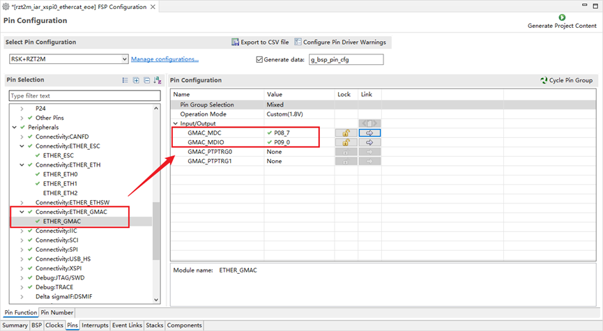

## RT-Thread Settings Configuration

Double-click to open RT-Thread Settings, search for the OpENer package, and enable it. The following is the related user configuration information:

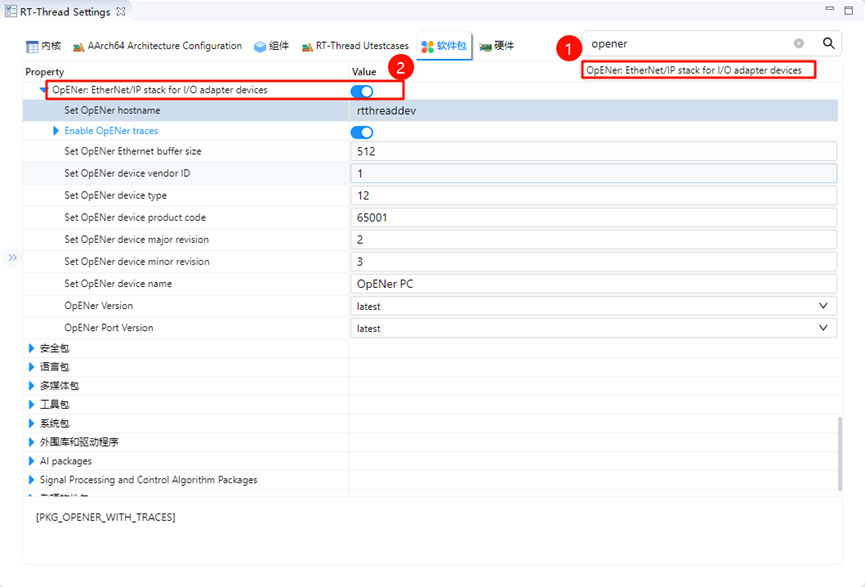

Next, disable DHCP and use a static IP. Go to Components -> Enable lwIP stack, and select disable DHCP:

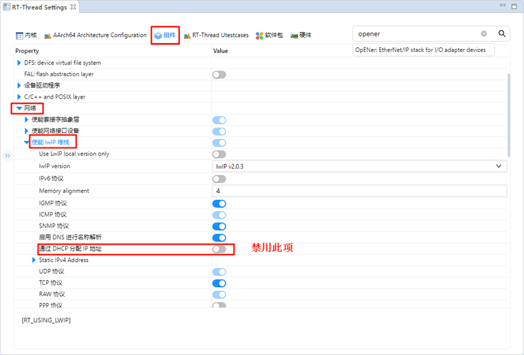

After completing the configuration, compile the program and download it to the development board.

## Network Configuration

We use a network cable to connect the development board to the PC, and set a static IP on the PC:


## Soft PLC Startup

**Introduction to CODESYS:**  
CODESYS is a PLC software developed by the German company 3S, which integrates PLC logic, motion control, configuration display, and other functionalities. CODESYS, short for "Controller Development System," is an industrial automation programming tool based on the IEC 61131-3 standard. It supports multiple programming languages (such as Ladder Logic, Structured Text, Function Block Diagram, etc.) and provides a rich set of libraries and function blocks, helping engineers rapidly develop and debug PLCs (Programmable Logic Controllers) and industrial control systems. The flexibility and powerful features of CODESYS make it a widely used development platform in the field of industrial automation.

### Create a Standard Project in CODESYS

Ensure that CODESYS software is installed. After installation, the following three components are required:


- CODESYS V3.5 SP20 Patch 3: Ethernet/IP Communication Simulation
- CODESYS Gateway V3: Gateway Device
- CODESYS Control Win V3 -x64 SysTray: Soft PLC Device

First, open **CODESYS V3.5 SP20 Patch 3**, then select -> New Project -> Projects -> Standard Project, and configure the project name and location before clicking OK:


After the pop-up window appears, keep the default configuration (CODESYS Control Win V3 (CODESYS) / x64 (CODESYS)) and click OK:

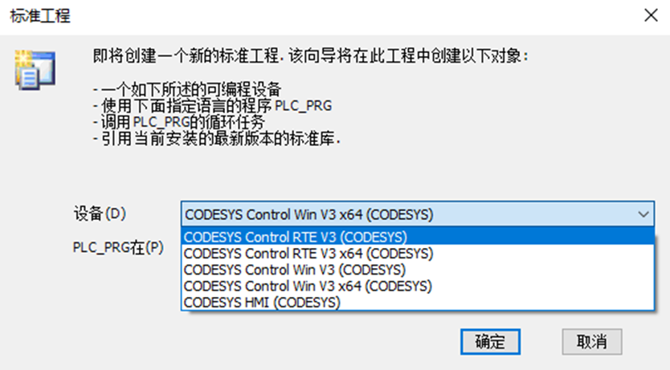

> Note: If you purchased **CODESYS Control RTE SL** (http://store.codesys.cn/codesys/store/detail.html?productId=58), you can select the device: CODESYS Control RTE V3 (CODESYS) / x64 (CODESYS). For normal evaluation purposes, you can choose not to install this extension package and create the project using the CODESYS Control Win V3 (CODESYS) / x64 (CODESYS) device.

Once the project is created, the main interface will be displayed:


### Gateway and Soft PLC Startup

Open the following two software programs:

- CODESYS Gateway V3 (Right-click Start Gateway)
- CODESYS Control Win V3 -x64 SysTray (Right-click Start PLC)

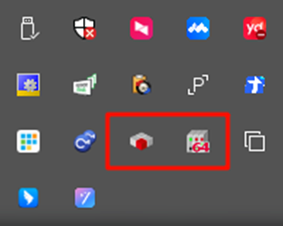

Return to the CODESYS main software, double-click **Device (CODESYS Control Win V3 x64)** -> **Communication Settings** -> **Scan Network**:


A device user login window will pop up. Enter the username and password (customized by the user):


Check whether the gateway device and soft PLC device are online:


### Add Ethernet/IP EDS File

An **EDS file** (Electronic Data Sheet) is a standard file format in Ethernet/IP used to describe device characteristics and communication parameters. It contains detailed information about the device, including its type, supported services, input/output definitions, parameter settings, device status, and configuration options.

The EDS file for this project is located at:

- `..\packages\OpENer_port-latest\eds_file`

Select the device repository installation description file and choose the **opener_sample_app.eds** file from the above path.

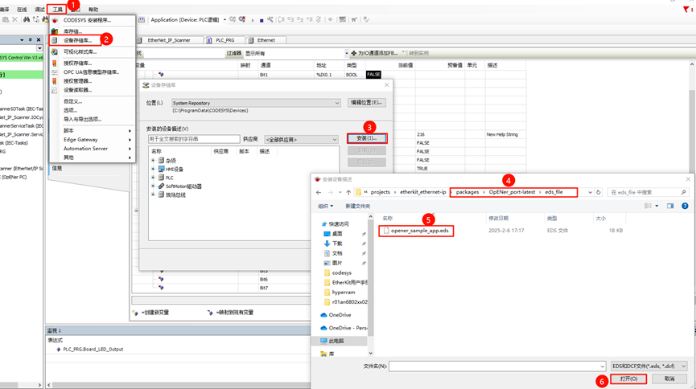

After successful installation, you can see the OpENer PC slave description file:


### Add Devices

- Add Ethernet: In the left navigation pane, right-click **Device** and select **Add Device**, then choose **Ethernet Adapter**:

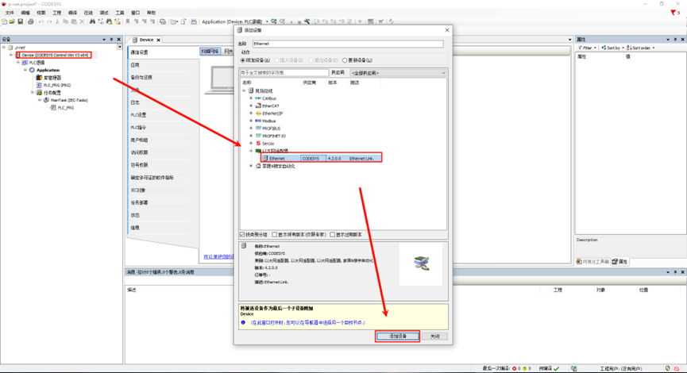

- Add EtherNet/IP Scanner: Right-click **Ethernet** in the left navigation pane and choose **EtherNet/IP Scanner**:


- Add EtherNet/IP Bus Device: Right-click **EtherNet/IP Scanner** in the left navigation pane and choose **OpENer PC**:


### Task Response

Keep the default configuration.

### Network Configuration

- Ethernet Configuration: Double-click **Ethernet (Ethernet)** in the left navigation pane -> **General**, change the network interface to the Ethernet port connected to the development board:


- EtherNet/IP Bus Device Network Configuration: Double-click **OpENer_PC (OpENer PC)** in the left navigation pane -> **General** -> **Address Settings**, change the IP parameters to the development board's IP address.

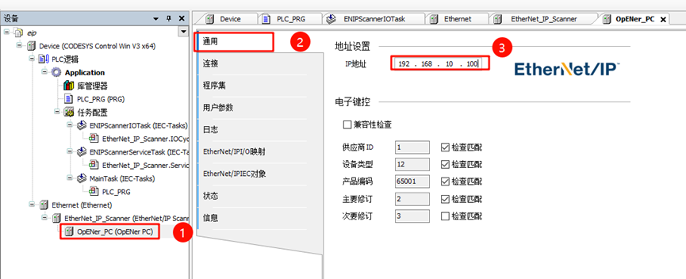

### EtherNet/IP Thread Application Startup

Once the development board is powered on, it will automatically start the OpENer thread when the network card link is detected:

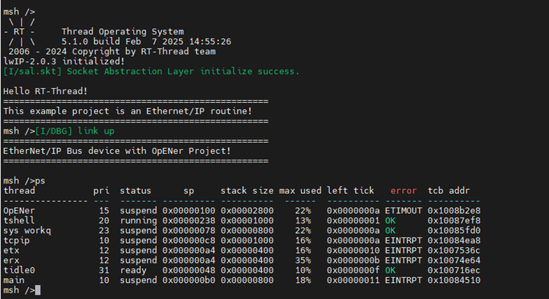

### Compile and Start Debugging the Project

- Step 1: In the project toolbar, select **Build** -> **Generate Code**
- Step 2: Select **Online** -> **Login**
- Step 

3: Click **Debug** -> **Start**

At this point, you can see that the EtherNet/IP Scanner is running properly:

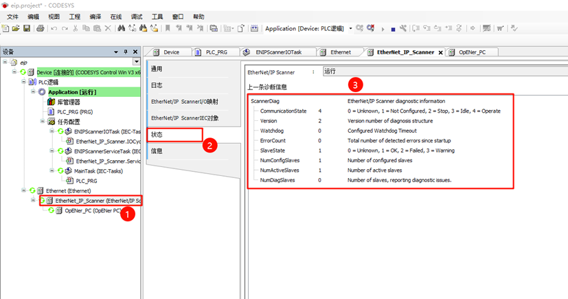

## PLC Programming and CIP IO Control

First, click **Device** -> **PLC Logic** -> **Application** -> **PLC_PRG (PRG)** in the left panel to open the PLC program, then use Structured Text (ST) to write variable definitions and program code:

* Variable Definition: The following variables include two key variables: `Board_SW_Input` (representing the controller's onboard switch array in bit-level) and `Board_LED_Output` (representing the controller's onboard LED in bit-level).

```st
PROGRAM PLC_PRG
VAR
    Board_SW_Input: BYTE;
    Board_LED_Output: BYTE;
    Mask: BYTE;
    Shift: INT;
    i: INT;
END_VAR
```

* Program Definition: This code sets the corresponding bits of `Board_LED_Output` based on the state of each bit of `Board_SW_Input`:
  * If a bit of `Board_SW_Input` is 1, the corresponding bit of `Board_LED_Output` is set to 1.
  * If a bit of `Board_SW_Input` is 0, the corresponding bit of `Board_LED_Output` is set to 0.

By iterating through all 8 bits, the input states are mapped to the output.

```st
FOR i := 0 TO 7 DO
    Shift := i;
    Mask := SHL(1, Shift);
    
    IF (Board_SW_Input AND Mask) = Mask THEN
        Board_LED_Output := Board_LED_Output OR Mask;
    ELSE
        Board_LED_Output := Board_LED_Output AND NOT Mask;
    END_IF
END_FOR
```

The configuration location in the project is as follows:

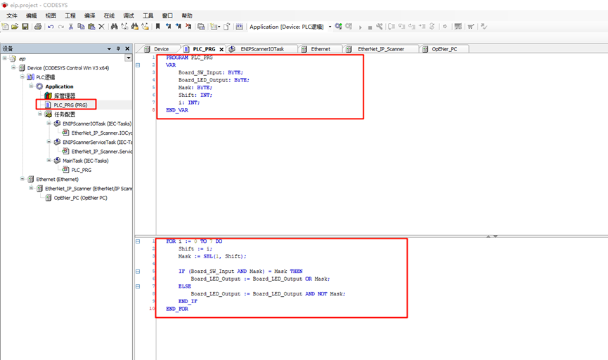

After loading the EDS file, only one connection configuration (Board LED Exclusive Owner) is shown by default. We also need to load another configuration embedded in the EDS file. Click **OpENer_PC (OpENer PC)** in the left menu -> **Connections**, click **Add Connection…**, and choose **Board SW Input Only**.

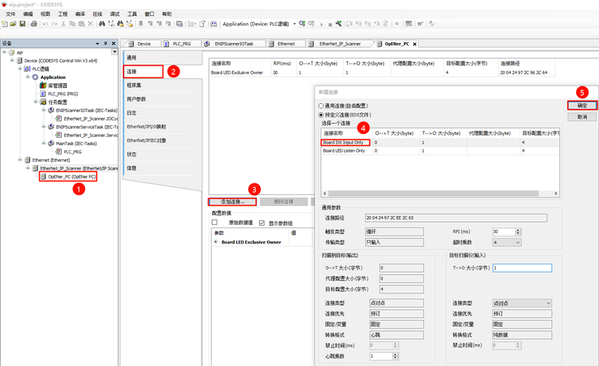

Next, click **Ethernet/IP I/O Mapping**, where we need to map the previously defined ST variables to the variables in this section. Map `Board_LED_Output` to the channel: **Board LED Output Data**; map `Board_SW_Input` to the channel: **Board SE Input Data**.

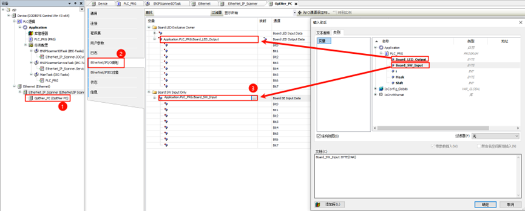

Finally, click **Build** -> **Generate Code**, then select **Online** -> **Login**. At this point, you can dynamically observe the program's running status. For example, when holding down KEY1 on the EtherKit development board, you will notice that LED0 (red) is off, and when releasing KEY1, LED0 stays on. When holding down KEY2, LED2 (green) will be off, and when releasing KEY2, LED2 stays on.

At the same time, you can also observe the current value of the bit in **OpENer_PC (OpENer PC)** -> **EtherNet/IP I/O Mapping**. When the corresponding bit of the key is TRUE, the key is pressed, and the corresponding LED bit turns on, showing the current value as TRUE:

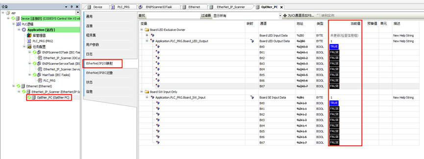