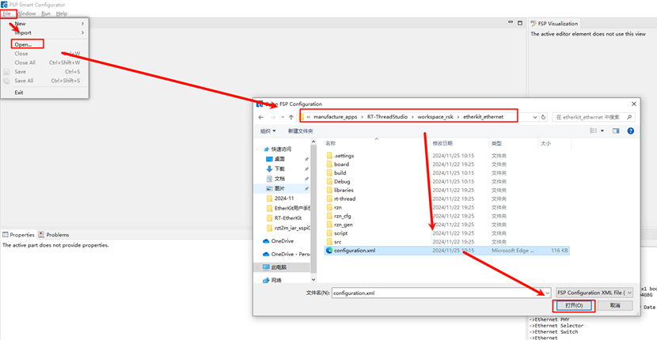
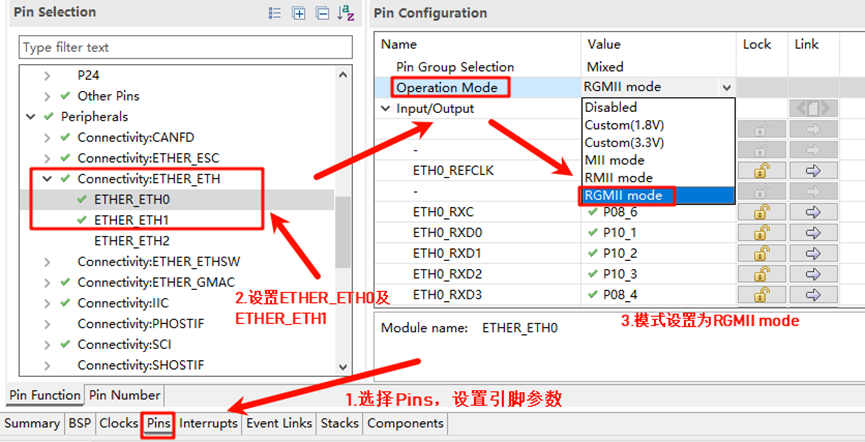
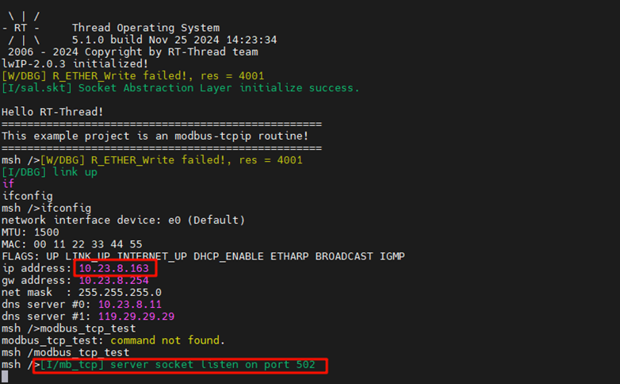

# Modbus-TCP/IP 例程

**中文** | [**English**](./README.md)

## 简介

本例程基于agile_modbus软件包，展示了通过TCP/IP方式实现modbus协议通信的示例。

## 硬件说明

## FSP配置说明

* 打开工程配置文件configuration.xml：

* 新增r_gamc Stack；

* 点击g_ether0 Ethernet，配置中断回调函数为user_ether0_callback；

* 下面配置phy信息，选择g_ether_phy0，Common配置为User Own Target；修改PHY LSI地址为1（根据原理图查询具体地址）；设置phy初始化回调函数为ether_phy_targets_initialize_rtl8211_rgmii()；同时设置MDIO为GMAC。

* 配置g_ether_selector0，选择以太网模式为交换机模式，PHY link设置为默认active-low，PHY接口模式设置为RGMII。

网卡引脚参数配置，选择操作模式为RGMII：

* ETHER_GMAC配置：

## RT-Thread Settings配置

回到Studio工程，配置RT-Thread Settings，点击选择硬件选项，找到芯片设备驱动，使能以太网；

找到软件包界面，在搜索框搜索modbus，并选择agile_modbus软件包后使能；

## 编译&下载

* RT-Thread Studio：在RT-Thread Studio 的包管理器中下载EtherKit 资源包，然后创建新工程，执行编译。
* IAR：首先双击mklinks.bat，生成rt-thread与libraries 文件夹链接；再使用Env 生成IAR工程；最后双击project.eww打开IAR工程，执行编译。

编译完成后，将开发板的Jlink接口与PC 机连接，然后将固件下载至开发板。

## 运行效果

首先找一根网线连接开发板网口及交换机（自己电脑有多余网口的也可以使用共享适配器操作），接着在串口工具输入命令：modbus_tcp_test，开启modbus-tcp示例；

打开Modbus Poll软件，连接并设置其模式为Modbus TCP/IP，IP为开发板IP信息，同时端口号为502；

连接成功后在开发板终端可以看到modbus客户端已连接：

回到Modbus Poll软件可以看到读写线圈功能都是正常的：

