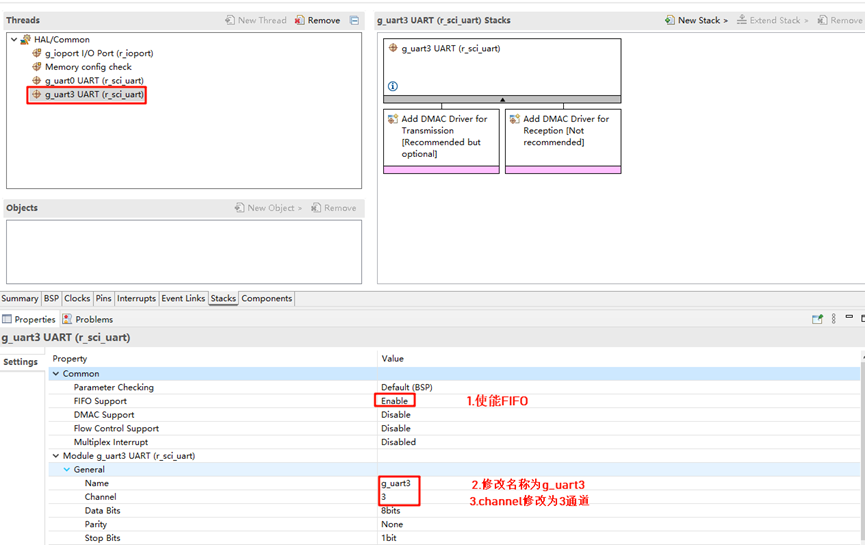
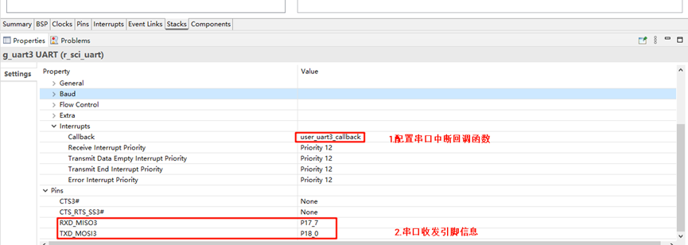
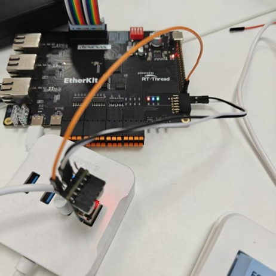
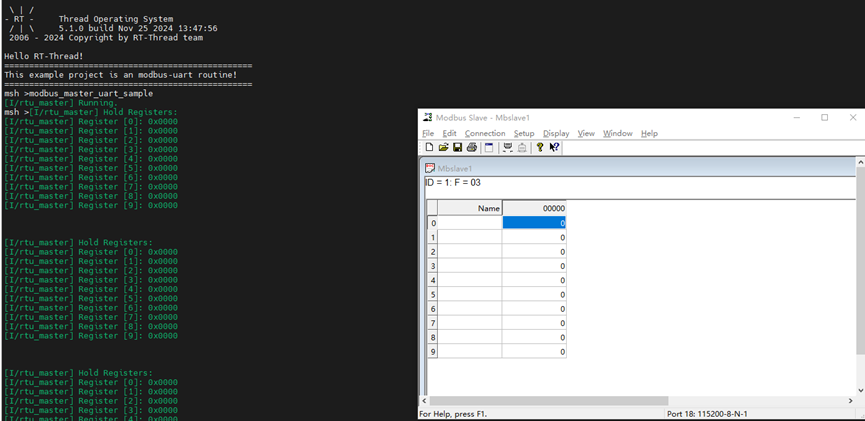

# Modbus-UART Usage Instructions

**English** | [**中文**](./README_zh.md)

## Introduction

This example is based on the agile_modbus package and demonstrates Modbus protocol communication over UART. Modbus UART is a version of the Modbus protocol implemented via serial communication and is widely used in industrial automation and control systems. Modbus is an open communication protocol used to transfer data between control devices and supports multiple physical layers such as UART, TCP/IP, and RS-485/232.

## Hardware Requirements

As shown in the image above, the peripheral used in this example is the SCI module. SCI3 is configured in UART mode, with TX pin as P18_0 and RX pin as P17_7.

## FSP Configuration Instructions

Open the `configuration.xml` file in the project and add a new stack:

Enable the `r_sci_uart` configuration and support FIFO. Set the channel number to 3:

Click on **Pins**, configure SCI3, and set the SCI mode to **Asynchronous mode**. The corresponding pins will be enabled accordingly:

Return to the stack configuration page, expand and set the interrupt callback function to `user_uart3_callback`. The corresponding UART pin information will be shown below:

## RT-Thread Settings Configuration

Back in RT-Thread Studio, go to **RT-Thread Settings**, enable UART3 for the serial port configuration:

In the software package interface, search for "modbus," select the `agile_modbus` package, and enable it:

## Compilation & Download

* **RT-Thread Studio**: Download the EtherKit resource package in the RT-Thread Studio package manager, create a new project, and compile it.
* **IAR**: First, double-click `mklinks.bat` to create the link between the rt-thread and libraries folders. Then, use Env to generate the IAR project. Finally, double-click `project.eww` to open the IAR project and compile it.

Once the compilation is complete, connect the Jlink interface of the development board to the PC and download the firmware to the board.

## Running Results

First, you need a USB-to-TTL module. Connect the TX and RX pins of the USB-to-TTL module to the RX and TX pins (P18_0 and P17_7) of the development board, respectively, as shown below:

Next, open the Modbus Slave software and click **Connect**:

Configure the Modbus Slave settings. Select **Serial Mode** for the connection type, choose the USB-to-TTL module connected to the development board, and set **None Parity**:

Then, return to the serial terminal and enter the command `modbus_master_uart_sample` to start the Modbus master example:

The development board's UART3 functions as the master, and the PC acts as the slave. The master writes to the coil at the station number, and the terminal will display the updated registers:

