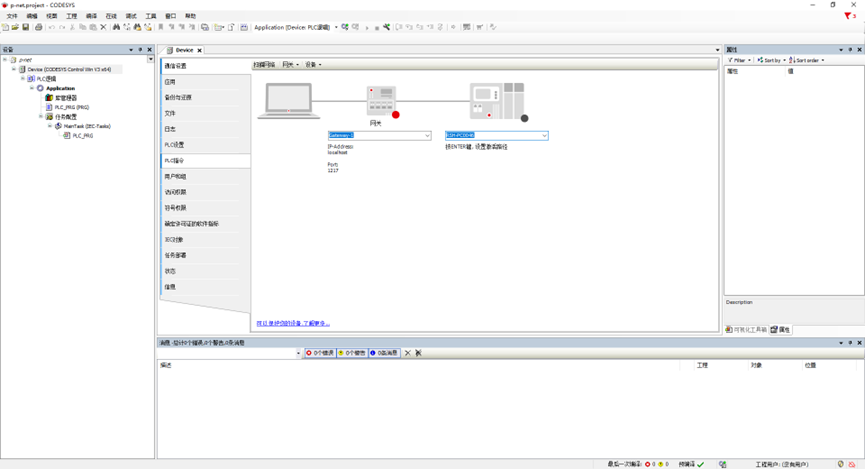
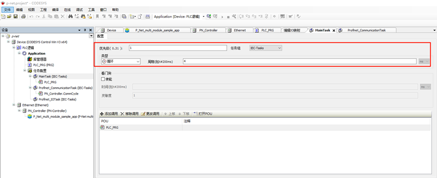

# EtherKit Development Board BSP Documentation

**English** | [**中文**](./README_zh.md)

## Introduction

PROFINET is an industrial Ethernet standard developed and promoted by PI (PROFIBUS and PROFINET International) and is widely used in the industrial automation field.

P-Net is an open-source PROFINET implementation, specifically designed for real-time network communication in embedded devices. It is a lightweight PROFINET protocol stack aimed at providing developers with a quick and efficient way to integrate PROFINET functionality into embedded platforms.

In this example, we will use the P-Net software package to implement PROFINET master-slave communication.

## Prerequisites

**Software Environment**:

- [CODESYS](https://us.store.codesys.com/) (PROFINET master simulation)
    - CODESYS
    - CODESYS Gateway (Gateway device)
    - CODESYS Control Win SysTray (PLC device)

**Hardware Environment**:

- EtherKit development board

## Software Package Configuration

Open the environment settings in `bsp` and go to **RT-Thread online packages** -> **IoT**, find **[\*] P-Net stack for Profinet device implementation --->** and enable it. The configuration options are provided to the user:

```c
-*- Default netif name for P-NET  --->
    -> (e00) default ethernet interface name for p-net app, default as 'e00'
-*- Enable P-NET sample board config  ---> 
    -> (0x0209) p-net user led pin
    -> (0x0005) p-net user key pin
-*- Default root filesystem path for P-NET  ---> 
    -> [*] p-net using ramfs filesystem by default, or you can turn this off and choose another way to enable the filesystem
    -> (8192)  default memory size for ramfs
-*- P-NET sample slave network ip config  ---> 
    -> (192.168.137.196) set static IP address for PROFINET slave
    -> (192.168.137.1) set static gateway address for PROFINET slave
    -> (255.255.255.0) set static mask address for PROFINET slave
version (latest)  ---> 
```

- **Default netif name for p-net**: p-net network interface name, default is `e00`;
- **Enable pnet sample board config**: p-net app user LED and key configuration;
- **Default root filesystem path for p-net**: p-net filesystem configuration, default uses ramfs with 8K memory allocation;
- **P-NET sample slave network ip config**: Static IP configuration for the p-net slave device (**Make sure to disable RT_LWIP_DHCP and use static IP**).

After configuring these settings, compile and download the program to the development board.

## Network Configuration

Connect the development board to the PC using an Ethernet cable, and configure a static IP on the PC:


Check the IP information on the development board and test connectivity:


## Soft PLC Startup

**CODESYS Overview**: CODESYS is a PLC software developed by 3S (Germany), integrating PLC logic, motion control, configuration, display, and other functions. CODESYS, short for **Controller Development System**, is an industrial automation programming tool based on the IEC 61131-3 standard. It supports various programming languages (e.g., Ladder Diagram, Structured Text, Function Block Diagram) and provides libraries and function modules, making it a widely used platform in industrial automation for developing and debugging PLCs and control systems.

### Creating a Standard Project in CODESYS

Ensure that you have CODESYS installed. After installation, the following three software components are required:

- **CODESYS V3.5 SP20 Patch 3**: PROFINET master simulation
- **CODESYS Gateway V3**: Gateway device
- **CODESYS Control Win V3 -x64 SysTray**: Soft PLC device

First, open **CODESYS V3.5 SP20 Patch 3**, choose **New Project** -> **Projects** -> **Standard project**, configure the project name and location, and click **OK**:


In the pop-up window, keep the default configuration and click **OK**:


> **Note**: If you have purchased **CODESYS Control RTE SL**, select the device: **CODESYS Control RTE V3 (CODESYS) / x64 (CODESYS)**. For evaluation purposes, you can choose **CODESYS Control Win V3 (CODESYS) / x64** to create the project.

After creation, you will see the main interface:



### Starting Gateway and Soft PLC

Open the following two software components:

- **CODESYS Gateway V3** (right-click **Start Gateway**)
- **CODESYS Control Win V3 -x64 SysTray** (right-click **Start PLC**)


Back in CODESYS, double-click **Device(CODESYS Control Win V3 x64)** -> **Communication Settings** -> **Scan Network**:


In the user login window, configure the username and password (customizable):


Check if the gateway and soft PLC devices are online:


### Adding PROFINET GSDML Files

**GSD** (Generic Station Description) files are used for PROFIBUS DP and PROFINET IO communication, describing parameters, diagnostic data, and user-defined data between the PLC and I/O modules.

The GSDML file for this project is located at:

- `..\src\ports\rtthread\pn_dev`

Install the GSDML file from the above path: **GSDML-V2.4-RT-Labs-P-Net-Sample-App-20220324.xml**.


After installation, you should see the **P-Net slave description file**:


### Adding Devices

- **Adding Ethernet**: Right-click **Device** in the left navigation bar and select **Ethernet Adapter**:


- **Adding PROFINET IO Master**: Right-click **Ethernet** in the left navigation bar and select **PN-Controller**:


- **Adding PROFINET IO Slave**: Right-click **PN-Controller** in the left navigation bar and select **P-Net-multiple-module sample app**:


### Configuring Tasks

- **Main Tasks Configuration**: Select **Application** -> **Task Configuration** in the left navigation bar, double-click **MainTask (IEC-Tasks)**, set the priority to 1, type to **Cyclic**, and cycle time to 4ms:



- **Profinet_CommunicationTask Configuration**: Double-click **Profinet_CommunicationTask (IEC-Tasks)**, set the priority to 14, type to **Cyclic**, and cycle time to 10ms:


### Network Configuration

- **Ethernet Configuration**: Double-click **Ethernet (Ethernet)** in the left navigation bar -> **General**, and modify the network interface to the one connected to the development board (ensure the correct master IP is selected if using multiple stations).


- **PN_Controller Configuration**: Double-click **PN_Controller (PN-Controller)** -> **General**, and modify the default slave IP parameters as needed.

- **P-Net Slave Network Configuration**: Double-click **P-Net-multiple-module sample app** -> **General**, and modify the IP parameters to match the development board’s IP:


### Compile and Debug the Project

- Step 1: From the navigation bar, select **Compile** -> **Generate Code**
- Step 2: Select **Online** -> **Login**
- Step 3: Click **Debug** -> **Start**

You should see the PN master successfully online:


## PROFINET Slave Application Startup

Start the PROFINET slave on the development board by executing the command: `pnet_app`:


## PN Protocol Stack Demo

In CODESYS, test the master-slave interaction by selecting **PN_Controller** in the left navigation bar, right-clicking **Scan Devices**, selecting the device, and clicking **Blink LED**:


The development board’s logs should display output and the onboard **User LED** will blink:

