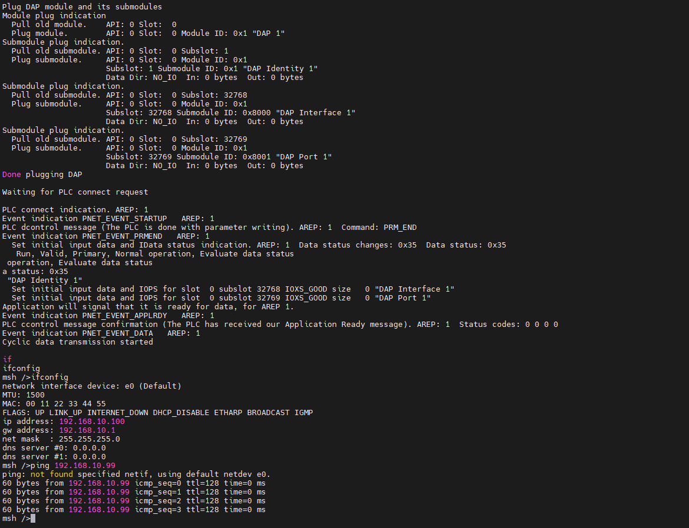
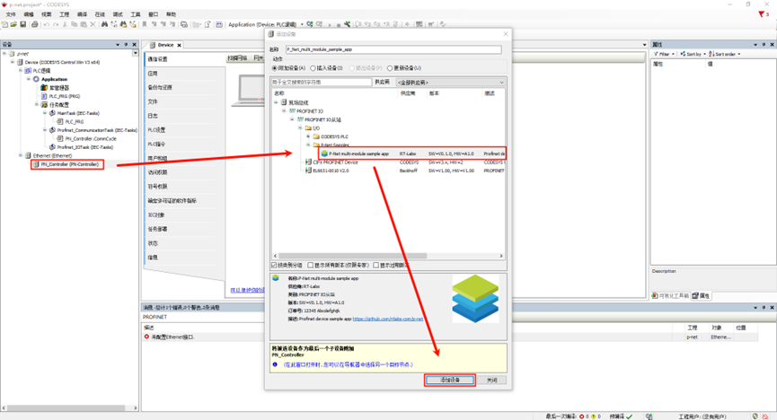
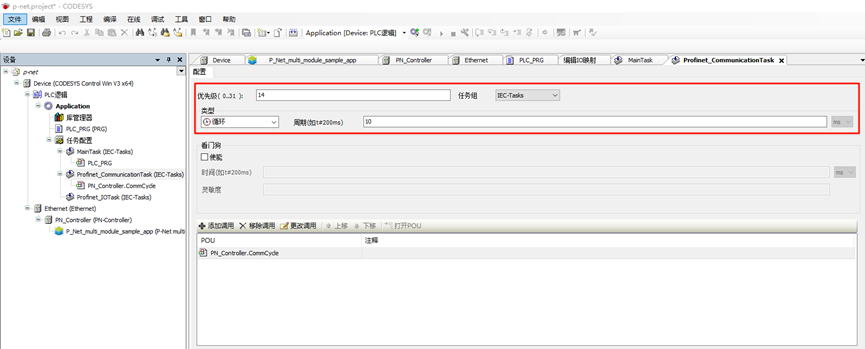
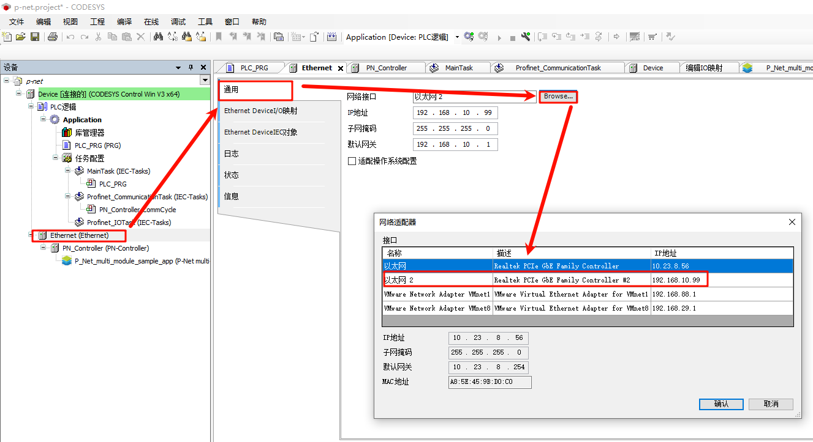
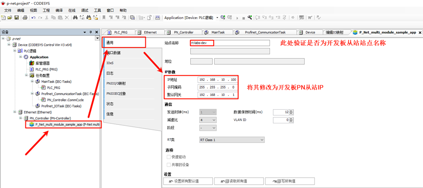
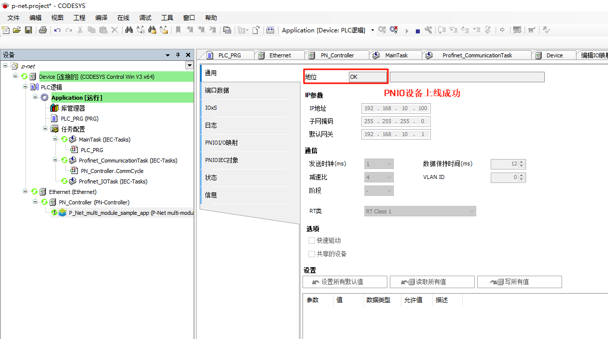
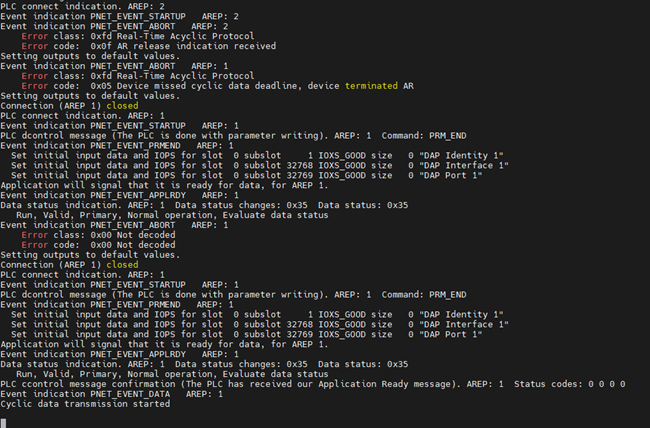
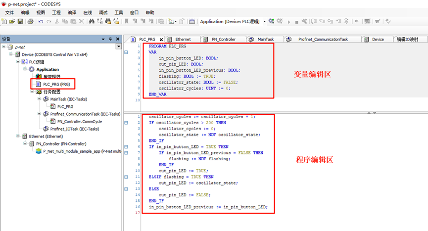
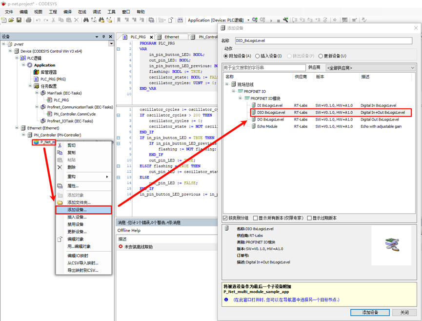

# PROFINET 例程

**中文** | [**English**](./README.md)

## 简介

PROFINET是由PI（PROFIBUS和PROFINET International）组织开发和推广的工业以太网标准，广泛应用于工业自动化领域。

P-Net协议是一个开源的PROFINET实现，专门用于嵌入式设备的实时网络通信。它是一个开源项目（p-net），目标是提供一个轻量级的PROFINET协议栈实现，使得开发者能够在嵌入式平台上快速集成PROFINET功能。

在本示例中将使用P-Net软件包来实现PROFINET主从站通信。

## 前期准备

软件环境：

- [CODESYS](https://us.store.codesys.com/)（profinet主站模拟）
- - CODESYS
  - CODESYS Gateway（网关设备）
  - CODESYS Control Win SysTray（软PLC设备）
- [Npcap](https://npcap.com/dist/npcap-1.80.exe)（该软件是运行CODESYS必须的，需要提前安装好！）

硬件环境：

- EtherKit开发板

## FSP配置

打开工程配置文件configuration.xml，新增r_gamc Stack：


点击g_ether0 Ethernet，配置中断回调函数为user_ether0_callback：


下面配置phy信息，选择g_ether_phy0，Common配置为User Own Target；修改PHY LSI地址为1（根据原理图查询具体地址）；设置phy初始化回调函数为ether_phy_targets_initialize_rtl8211_rgmii()；同时设置MDIO为GMAC。


配置g_ether_selector0，选择以太网模式为交换机模式，PHY link设置为默认active-low，PHY接口模式设置为RGMII。


网卡引脚参数配置，选择操作模式为RGMII：


ETHER_GMAC配置：


## RT-Thread Settings 配置

双击打开 RT-Thread Settings，在搜索栏检索p-net软件包并使能，下面是相关用户配置信息说明；


- **Default netif name for p-net**：p-net 网卡设备接口名称，默认为 e00 ；
- **Enable pnet sample board config**：p-net app 用户LED及按键配置；
- **Default root filesystem path for p-net**：p-net 文件系统配置，默认使用 ramfs ，默认分配 8K 内存空间；
- **P-NET sample slave network ip config**：p-net 从站设备静态IP配置（**请关闭 RT_LWIP_DHCP 功能，使用静态IP**）

下面我们还需要配置禁用dhcp功能并使用静态IP，点击组件->使能lwip堆栈，选择禁用DHCP；


完成上述配置后，将程序编译下载至开发板。

## 网络配置

我们使用一根网线连接开发板与PC，同时在PC端配置静态IP：


检查开发板端的 IP 信息，并测试联通性：



## 软PLC启动

CODESYS简介：CODESYS是德国3S公司开发的PLC软件，集成了PLC逻辑、运动控制、组态显示等功能。CODESYS，全称为“Controller Development System”，是一种基于 IEC 61131-3 标准的工业自动化编程工具。它不仅支持多种编程语言（如梯形图、结构化文本、功能块图等），还提供了丰富的库和功能模块，帮助工程师快速开发和调试 PLC（可编程逻辑控制器）和工业控制系统。CODESYS 的灵活性和强大功能使其成为工业自动化领域广泛使用的开发平台。

### CODESYS创建标准工程

请确保已安装CODESYS软件，安装之后下面这三个是我们需要用到的软件：


- CODESYS V3.5 SP20 Patch 3：Profinet 主站模拟
- CODESYS Gateway V3：网关设备
- CODESYS Control Win V3 -x64 SysTray：软PLC设备

首先打开 **CODESYS V3.5 SP20 Patch 3**，依次选择 -> 新建工程 -> Projects -> Standard project ，配置工程名称及位置后点击确定：


弹出下面这个弹窗后保持默认配置(CODESYS Control Win V3 (CODESYS) / x64 (CODESYS))点击确定：


> 注意：如果您购买了[**CODESYS Control RTE SL**](http://store.codesys.cn/codesys/store/detail.html?productId=58)，可选择设备：CODESYS Control RTE V3 (CODESYS) / x64 (CODESYS)，正常评估用途可选择不安装此扩展包，选择 CODESYS Control Win V3 (CODESYS) / x64 (CODESYS) 设备创建即可。

创建成功后就可以看到主界面了：


### Gateway 及 软PLC 启动

依次打开下面两个软件：

- CODESYS Gateway V3（右键 Start Gateway）
- CODESYS Control Win V3 -x64 SysTray（右键 Start PLC）


回到 CODESYS 主站软件，双击 Device(CODESYS Control Win V3 x64) -> 通信设置 -> 扫描网络：


弹出设备用户登录窗口后，配置用户名和密码（用户自定义）：


检查网关设备及软PLC设备是否在线：


### profinet GSDML文件添加

GSD(Generic Station Description file)：即通用站点描述文件，主要用于PROFIBUS DP（GSD文件）和PROFINET IO（GSDML文件）通信，作为描述文件，是PLC系统中CPU模块和IO模块之间的桥梁，通常包括通道数据、参数数据、诊断数据以及用户自定义数据。

本项目的 GSDML文件位于如下路径：

- ..\src\ports\rtthread\pn_dev

选择设备存储库安装描述文件，选择上述路径下的 **GSDML-V2.4-RT-Labs-P-Net-Sample-App-20220324.xml** 文件。


安装成功后可以看到 p-net 从站描述文件：


### 设备添加

- Ethernet添加：左侧导航栏点击Device并右键添加设备，选择以太网适配器；


图20-13 Ethernet添加

- PROFINET IO主站添加：右键左侧导航栏中的Ethernet，选择PN-Controller


- PROFINET IO从站添加：右键左侧导航栏中的 PN-Controller，选择 P-Net-multiple-module sample app



### 任务响应

- Main Tasks 配置：左侧导航栏选择 Application -> 任务配置 -> 双击MainTask(IEC-Tasks)，优先级设置为1，类型选择循环，周期选择 4ms；


- Profinet_CommunicationTask 配置：双击 Profinet_CommunicationTask(IEC-Tasks)，优先级设置为14，类型选择循环，周期设置为 10ms。



### 网络配置

- Ethernet 配置：双击左侧导航栏中的Ethernet(Ethernet) -> 通用，修改网络接口为连接到开发板的以太网端口；



- PN_Controller 配置：双击左侧导航栏     PN_Controller(PN-Controller) -> 通用，并正确修改默认从站IP参数的区间，根据提示修改即可。
- P-Net 从站网络配置：双击左侧导航栏 P-Net-multiple-module sample app -> 通用， 修改IP参数为开发板IP




### 工程编译并启动调试

- step1：工程上方导航栏选择 编译-> 生成代码
- step2：选择 在线 -> 登录
- step3：点击 调试 -> 启动

此时就可以看到 PN 主站已经上线成功


## profinet 从站应用启动

开发板端上电后，一旦检测到网卡 link up，则会自动启动 PN 从站：




## PN协议栈运行demo

这里我们使用 CODESYS软件来测试 PN 的主从站交互。

### LED闪烁

回到 CODESYS 软件，左侧导航栏选择 PN_Controller，右键点击扫描设备，单击设备名后点击闪烁LED：


此时的开发板端（PN从站IO）可以看到日志输出，并伴随板载User LED闪烁：


### 从站 I&M(标识和维护) 数据修改

依然是扫描设备界面，我们点击左下角的 I&M，修改信息并写入 I&M：


同时 PNIO 会更新从站配置信息：



我们再次点击查看 I&M，即可发现 I&M 修改成功！

### PLC编程及PNIO控制

首先我们点击左侧面板的Device->PLC逻辑->Application->PLC_PRG(PRG)，使用ST语言编程，编写变量及程序代码：

* 变量定义：这些变量定义了按钮的输入状态（in_pin_button_LED），LED 的输出状态（out_pin_LED）以及控制 LED 是否闪烁的状态变量（flashing）。振荡器状态（oscillator_state）和振荡器周期计数器（oscillator_cycles）用来实现定时闪烁效果。

```st
PROGRAM PLC_PRG
VAR
    in_pin_button_LED: BOOL;
    out_pin_LED: BOOL;
    in_pin_button_LED_previous: BOOL;
    flashing: BOOL := TRUE;
    oscillator_state: BOOL := FALSE;
    oscillator_cycles: UINT := 0;
END_VAR
```

* 程序定义：
  1. 首先在每次循环中，oscillator_cycles 增加 1。当计数器超过 200 时，重置计数器并切换 oscillator_state 的状态（TRUE 或 FALSE），实现周期性变化；
  1. 如果按钮被按下（in_pin_button_LED 为 TRUE），并且在上一周期按钮状态是 FALSE，则切换 flashing 状态。即每次按钮按下时，切换 LED 是否闪烁的状态。
  1. 如果 flashing 为 TRUE，则 LED 会根据振荡器状态 (oscillator_state) 闪烁；如果 flashing 为 FALSE，LED 直接关闭。
  1. 在每次循环结束时，将当前按钮的状态保存在 in_pin_button_LED_previous 中，以便在下次判断按钮按下的事件。

```st
oscillator_cycles := oscillator_cycles + 1;
IF oscillator_cycles > 200 THEN 
    oscillator_cycles := 0;
    oscillator_state := NOT oscillator_state;
END_IF
IF in_pin_button_LED = TRUE THEN 
    IF in_pin_button_LED_previous = FALSE THEN 
        flashing := NOT flashing; 
    END_IF
    out_pin_LED := TRUE;
ELSIF flashing = TRUE THEN 
    out_pin_LED := oscillator_state;
ELSE 
    out_pin_LED := FALSE;
END_IF
in_pin_button_LED_previous := in_pin_button_LED;
```

工程中的配置位置如下图所示：



接下来我们还需要添加一个内置的IO模块，右键点击P_Net_multi_module_sample_app然后添加一个IO模块（DIO 8xLogicLevel），如下图所示：



接下来双击DIO_8xLogicLevel节点，选择PNIO Module I/O映射，编辑Input Bit 7和Output Bit 7并绑定PLC变量：


接着我们点击上方导航栏的编译->生成代码，然后选择在线->登录，运行查看现象；


接下来回到CODESYS，再次双击Device->PLC逻辑->Application下的PLC_PRG(PRG)，此时便可动态观察程序运行状态，例如我们按住etherkit开发板上的KEY0，可以发现in_pin_button_LED及in_pin_button_LED_previous 这两个变量值为FALSE，此时再松开KEY0，可以发现flashing值反转一次。

