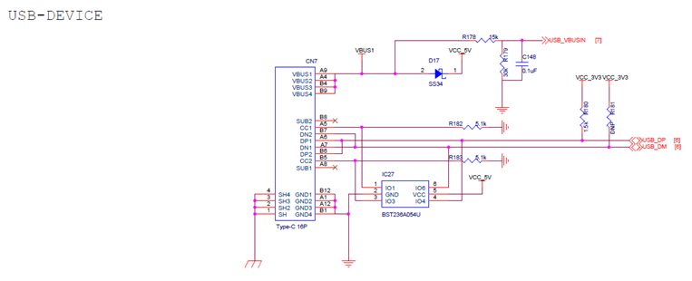
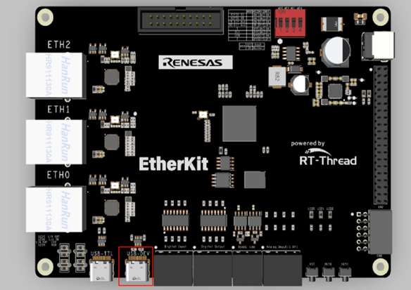
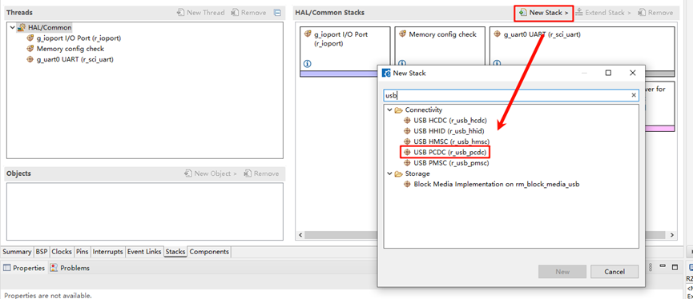
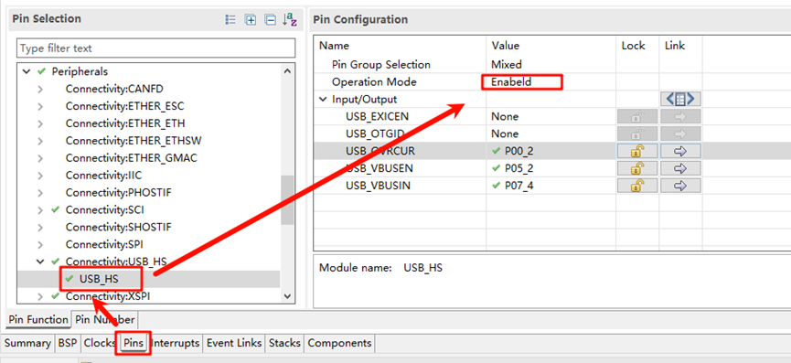

# EtherKit USB-PCDC例程

**中文** | [**English**](./README.md)

## 简介

本例程展示了通过USB方式实现模拟串口的示例。USB PCDC 是 USB 通信设备类（Communication Device Class, CDC）的一种子类，通常用于实现虚拟串口通信功能。在嵌入式设备开发中，USB PCDC 常被用于通过 USB 接口将设备模拟为串行通信端口（如 COM 端口），以便与主机进行数据交互。

## 硬件说明



EtherKit提供一个USB-Device外设，位于开发板的位置如下所示：



## FSP配置说明

* 使用fsp打开工程下的configuration.xml文件，并添加usb_pmcs stack；



* 添加g_rm_block_media0；


* 选择g_basic0_usb，设置其中断回调函数为usb_apl_callback：


* 下面配置USB引脚，找到USB_HS并使能：



## 构建配置

进入工程找到指定路径下的文件：.\rzn\SConscript，替换该文件为如下内容：

```c
Import('RTT_ROOT')
Import('rtconfig')
from building import *
from gcc import *

cwd = GetCurrentDir()
src = []
group = []
CPPPATH = []

if rtconfig.PLATFORM in ['iccarm'] + GetGCCLikePLATFORM():
    if rtconfig.PLATFORM == 'iccarm' or GetOption('target') != 'mdk5':
        src += Glob('./fsp/src/bsp/mcu/all/*.c')
        src += Glob('./fsp/src/bsp/mcu/all/cr/*.c')
        src += Glob('./fsp/src/bsp/mcu/r*/*.c')
        src += Glob('./fsp/src/bsp/cmsis/Device/RENESAS/Source/*.c')
        src += Glob('./fsp/src/bsp/cmsis/Device/RENESAS/Source/cr/*.c')
        src += Glob('./fsp/src/r_*/*.c')
        src += Glob('./fsp/src/r_usb_basic/src/driver/*.c')
        src += Glob('./fsp/src/r_usb_basic/src/hw/*.c')
        src += Glob('./fsp/src/r_usb_pcdc/src/*.c')
        CPPPATH = [ cwd + '/arm/CMSIS_5/CMSIS/Core_R/Include',
                            cwd + '/fsp/inc',
                            cwd + '/fsp/src/inc',
                            cwd + '/fsp/inc/api',
                            cwd + '/fsp/inc/instances',
                            cwd + '/fsp/src/r_usb_basic/src/driver/inc',
                            cwd + '/fsp/src/r_usb_basic/src/hw/inc',
                            cwd + '/fsp/src/r_usb_pcdc/src/inc',]

group = DefineGroup('rzn', src, depend = [''], CPPPATH = CPPPATH)
Return('group')
```

使用studio开发的话需要右键工程点击 **同步scons配置至项目**；如果是使用IAR开发请在当前工程下右键打开env，执行：scons –target=iar 重新生成配置。

## RT-Thread Settings配置

USB示例目前使用的是freertos接口驱动，因此我们还需要使能Freertos兼容层软件包；


## 编译&下载

* RT-Thread Studio：在RT-Thread Studio 的包管理器中下载EtherKit 资源包，然后创建新工程，执行编译。
* IAR：首先双击mklinks.bat，生成rt-thread与libraries 文件夹链接；再使用Env 生成IAR工程；最后双击project.eww打开IAR工程，执行编译。

编译完成后，将开发板的Jlink接口与PC 机连接，然后将固件下载至开发板。

## 运行效果

生成FSP配置之后进行编译下载，将代码烧录到开发板即可自动启动该示例，同时在文件管理器中可以发现多出了一个U盘设备；


接着我们打开虚拟的串口设备，并测试字符输入：

