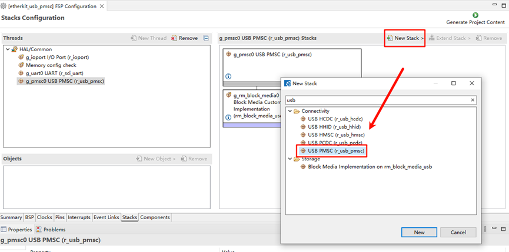
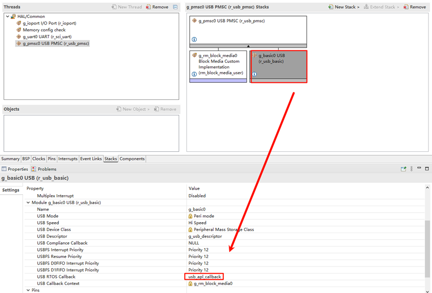
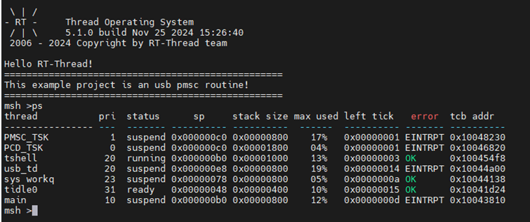

# USB-PMSC Driver Usage Instructions

**English** | [**中文**](./README_zh.md)

## Introduction

This example demonstrates how to implement a USB flash drive using the USB-PMSC (USB Peripheral Mass Storage Class). USB-PMSC is a USB device class that enables USB-based storage device functionality.

## Hardware Requirements


EtherKit provides a USB-Device peripheral, located on the development board as shown below:


## FSP Configuration Instructions

* Open the project’s `configuration.xml` file using FSP and add the `usb_pmcs` stack:



* Add `g_rm_block_media0`:


* Select `g_basic0_usb` and set the interrupt callback function to `usb_apl_callback`:



* Next, configure the USB pins. Find `USB_HS` and enable it:


## Build Configuration

Locate the file at the specified path in the project: `.\rzn\SConscript` and replace its content with the following:

```c
Import('RTT_ROOT')
Import('rtconfig')
from building import *
from gcc import *

cwd = GetCurrentDir()
src = []
group = []
CPPPATH = []

if rtconfig.PLATFORM in ['iccarm'] + GetGCCLikePLATFORM():
    if rtconfig.PLATFORM == 'iccarm' or GetOption('target') != 'mdk5':
        src += Glob('./fsp/src/bsp/mcu/all/*.c')
        src += Glob('./fsp/src/bsp/mcu/all/cr/*.c')
        src += Glob('./fsp/src/bsp/mcu/r*/*.c')
        src += Glob('./fsp/src/bsp/cmsis/Device/RENESAS/Source/*.c')
        src += Glob('./fsp/src/bsp/cmsis/Device/RENESAS/Source/cr/*.c')
        src += Glob('./fsp/src/r_*/*.c')
        src += Glob('./fsp/src/r_usb_basic/src/driver/*.c')
        src += Glob('./fsp/src/r_usb_basic/src/hw/*.c')
        src += Glob('./fsp/src/r_usb_pmsc/src/*.c')
        CPPPATH = [ cwd + '/arm/CMSIS_5/CMSIS/Core_R/Include',
                            cwd + '/fsp/inc',
                            cwd + '/fsp/src/inc',
                            cwd + '/fsp/inc/api',
                            cwd + '/fsp/inc/instances',
                            cwd + '/fsp/src/r_usb_basic/src/driver/inc',
                            cwd + '/fsp/src/r_usb_basic/src/hw/inc',
                            cwd + '/fsp/src/r_usb_pmsc/src/inc',]

group = DefineGroup('rzn', src, depend = [''], CPPPATH = CPPPATH)
Return('group')
```

If you are using Studio for development, right-click the project and select **Sync SCons Configuration to Project**. For IAR development, right-click within the current project to open the environment, and run the command:`scons --target=iar` to regenerate the configuration.

## RT-Thread Settings Configuration

The USB example currently uses the FreeRTOS interface driver, so we also need to enable the FreeRTOS compatibility layer package:


## Compilation & Download

* **RT-Thread Studio**: Download the EtherKit resource package in the RT-Thread Studio package manager, create a new project, and compile it.
* **IAR**: First, double-click `mklinks.bat` to create the link between the rt-thread and libraries folders. Then, use Env to generate the IAR project. Finally, double-click `project.eww` to open the IAR project and compile it.

Once the compilation is complete, connect the Jlink interface of the development board to the PC and download the firmware to the board.

## Running Results

After generating the FSP configuration, compile and download the firmware to the development board. The example will automatically start. In the file manager, you will see an additional USB device:



